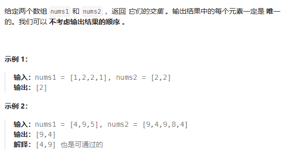

# 两个数组的交集



暴力求解的时间复杂度是O(n^2),这道题没有输入的限制，无法使用数组来替代哈希表。

**如果哈希值比较少，特别分散，跨度很大，那么使用数组就会造成极大的空间浪费**

此时可以使用set类：
```cpp
std::set;
std::nultiset;
std::unordered_set;
``````

| class | 底层实现 | 是否有序 | 数值是否可重复 | 数值是否可更改 | 查询效率 | 增删效率 |
| -- | -- | -- | -- | -- | -- | -- |
| set | 红黑树 | 有序 | 否 | 否 | logn | logn |
| multiset | 红黑树 | 有序 | 是 | 否 | logn | logn| 
| unordered_set | 哈希表 | 无序 | 否 | 否 | 1 | 1 |

**当要使用set来解决哈希问题的时候，优先使用unordered_set，因为它的查询和增删的效率最高**

# unordered_set的用法
1. unordered_set的特性
```bash
1.不再以键值对的形式存储数据，而是直接存储数据的值 ；
2.容器内部存储的各个元素的值都互不相等，且不能被修改；
3.不会对内部存储的数据进行排序
``````

2. 初始化undered_set
   ```cpp
    unordered_set<int> set1; //创建空的set    
    unordered_set<int> set2(set1) //拷贝构造
    unordered_set<int> set3(set1.begin(), set1.end()); //使用迭代器构造
    unordered_set<int> set4(array, array+5); // 使用数组作为其初值进行构造
    unordered_set<int> set5(move(set2)); //移动构造
    unordered_set<int> set6 {1, 3, 4, 6}; //使用初始列表进行构造
   ```

3. 常用内置函数
```cpp
set.empty(); //若容器为空，则返回true
set.find(num); //若查找到num，返回迭代器，失败返回set.end()
set.count(num); //返回num出现的次数
``````