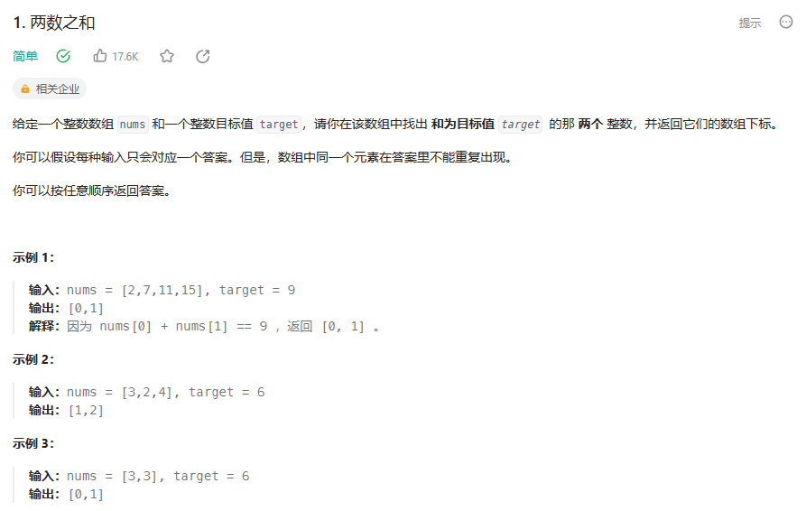
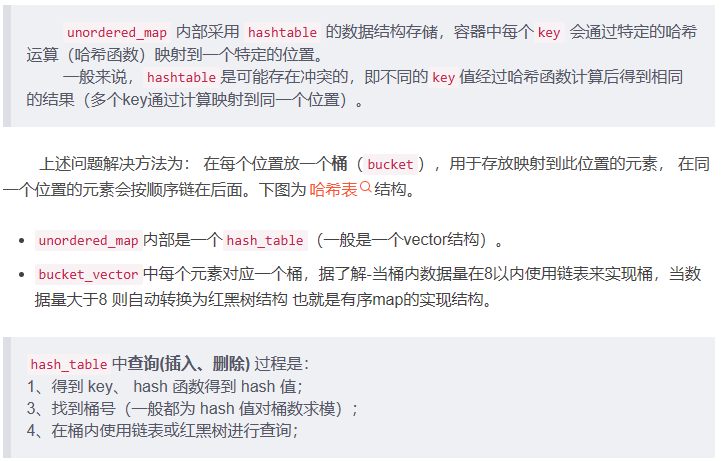

# 题目



**分析：** set是一个集合，里面放的元素只能是一个key，而本题要记录y的下标位置，所以set不能使用
**此时要选择另一种数据结构map<key,value>**

| map | 底层实现 | 是否有序 | 数值是否可重复 | 能否更改数值 | 查询效率 | 增删效率 |
| -- | -- | -- | -- | -- | -- | -- |
| map | 红黑树 | key有序 | key不可重复 | key不可修改 | logn | logn |
| multimap | 红黑树 | key有序 | key可重复 | key不可修改 | logn | logn |
|unordered_map| 哈希表 | key无序 | key不可重复 | key不可修改 | 1 | 1 |

# unordered_map底层原理



1. 迭代器
```cpp
unordered_map<Key,T>::iterator it;
it->first; //key 
it->second; //value
``````
**2. 构造函数**
```cpp
std::unordered_map<std::string, size_t> people {{"Jan",44}, {"Jim", 33}, {"Joe", 99}};
std::unordered_map<std::string,size_t> people {{ { "Jan", 44}, {"Jim", 33}, {"Joe", 99}}, 10}; //指定分配是个key-value


// 可以用迭代器定义的一段pair对象来生成容器
std::vector<std::pair<string, size_t>>folks {{ "Jan",44}, {"Jim", 33}, {"Joe", 99},{"Dan", 22},{"Ann", 55}, {"Don", 77}};
std::unordered_map<string, size_t> neighbors {std::begin(folks), std::end(folks) , 500};
``````
3. 插入元素
```cpp
 1 // unordered_map::insert
 2 #include <iostream>
 3 #include <string>
 4 #include <unordered_map>
 5 using namespace std;
 6 
 7 void display(unordered_map<string,double> myrecipe,string str)
 8 {
 9     cout << str << endl;
10     for (auto& x: myrecipe)
11         cout << x.first << ": " << x.second << endl;
12     cout << endl;
13 }
14 
15 int main ()
16 {
17     unordered_map<string,double>
18     myrecipe,
19     mypantry = {{"milk",2.0},{"flour",1.5}};
20 
21     /****************插入*****************/
22     pair<string,double> myshopping ("baking powder",0.3);
23     myrecipe.insert (myshopping);                        // 复制插入
24     myrecipe.insert (make_pair<string,double>("eggs",6.0)); // 移动插入
25     myrecipe.insert (mypantry.begin(), mypantry.end());  // 范围插入
26     myrecipe.insert ({{"sugar",0.8},{"salt",0.1}});    // 初始化数组插入(可以用二维一次插入多个元素，也可以用一维插入一个元素)
27     myrecipe["coffee"] = 10.0;  //数组形式插入
28 
29     display(myrecipe,"myrecipe contains:");
30 
31     /****************查找*****************/
32     unordered_map<string,double>::const_iterator got = myrecipe.find ("coffee");
33 
34     if ( got == myrecipe.end() )
35         cout << "not found";
36     else
37         cout << "found "<<got->first << " is " << got->second<<"\n\n";
38     /****************修改*****************/
39     myrecipe.at("coffee") = 9.0;
40     myrecipe["milk"] = 3.0;
41     display(myrecipe,"After modify myrecipe contains:");
42 
43 
44     /****************擦除*****************/
45     myrecipe.erase(myrecipe.begin());  //通过位置
46     myrecipe.erase("milk");    //通过key
47     display(myrecipe,"After erase myrecipe contains:");
48 
49     /****************交换*****************/
50     myrecipe.swap(mypantry);
51     display(myrecipe,"After swap with mypantry, myrecipe contains:");
52 
53     /****************清空*****************/
54     myrecipe.clear();
55     display(myrecipe,"After clear, myrecipe contains:");
56     return 0;
``````
4. 遍历
```cpp
 1 // unordered_map::bucket_count
 2 #include <iostream>
 3 #include <string>
 4 #include <unordered_map>
 5 using namespace std;
 6 
 7 int main ()
 8 {
 9     unordered_map<string,string> mymap =
10     {
11         {"house","maison"},
12         {"apple","pomme"},
13         {"tree","arbre"},
14         {"book","livre"},
15         {"door","porte"},
16         {"grapefruit","pamplemousse"}
17     };
18     /************begin和end迭代器***************/
19     cout << "mymap contains:";
20     for ( auto it = mymap.begin(); it != mymap.end(); ++it )
21         cout << " " << it->first << ":" << it->second;
22     cout << endl;
23     /************bucket操作***************/
24      unsigned n = mymap.bucket_count();
25 
26     cout << "mymap has " << n << " buckets.\n";
27 
28     for (unsigned i=0; i<n; ++i)
29     {
30         cout << "bucket #" << i << "'s size:"<<mymap.bucket_size(i)<<" contains: ";
31         for (auto it = mymap.begin(i); it!=mymap.end(i); ++it)
32             cout << "[" << it->first << ":" << it->second << "] ";
33         cout << "\n";
34     }
35 
36     cout <<"\nkey:'apple' is in bucket #" << mymap.bucket("apple") <<endl;
37     cout <<"\nkey:'computer' is in bucket #" << mymap.bucket("computer") <<endl;

``````