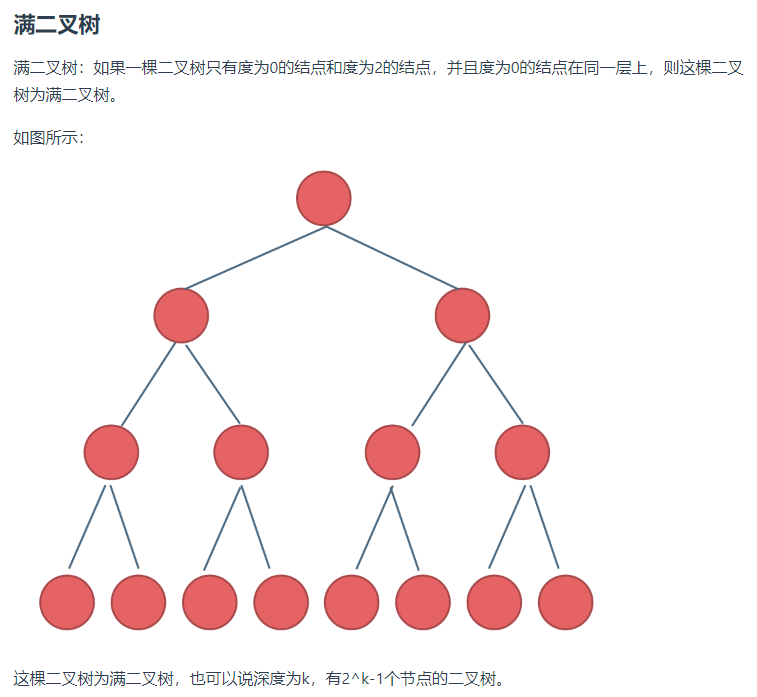
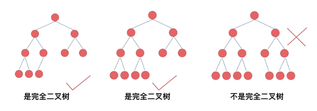
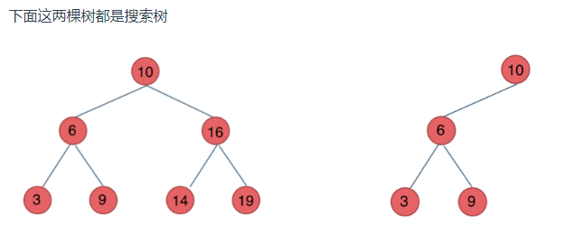
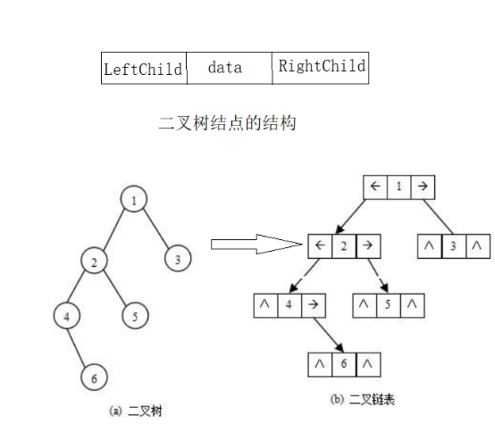

# 二叉树理论基础
1.1 二叉树的种类
1.1.1 **满二叉树**：n层满二叉树中节点数量为：2^n-1

1.1.2 **完全二叉树**：除了底层可能没有填满 ，其余每层节点数都达到最大值，并且最下面一层的节点都集中在该层最左边的若干位置。若最底层为第 h 层（h从1开始），则该层包含 1~ 2^(h-1) 个节点。

1.1.3 **二叉搜索树**：前面介绍的树，都没有数值的，而二叉搜索树是有数值的了，二叉搜索树是一个有序树。
若它的左子树不空，则左子树上所有结点的值均小于它的根结点的值；
若它的右子树不空，则右子树上所有结点的值均大于它的根结点的值；
它的左、右子树也分别为二叉排序树


# 二叉树的存储方式
二叉树的存储结构有两种，分别为**顺序存储**和**链式存储**
只有完全二叉树才可以用顺序存储
#### 用数组存储的二叉树是如何遍历的？
如果父节点的数组下标是i，那么它的左孩子就是i*2+1，右孩子就是i*2+2
#### 二叉树的链式存储

二叉树的链式存储结构是指，用链表来表示一棵二叉树，即用链来指示元素的逻辑关系。 通常的方法是链表中每个结点由三个域组成，数据域和左右指针域，左右指针分别用来给出该结点左孩子和右孩子所在的链结点的存储地址 。

# 二叉树的遍历方式
1. 深度优先遍历：先往深处遍历，遇到叶子节点时再往回遍历
   1. 前序遍历（中>左>右）
   2. 中序遍历（左>中>右）
   3. 后序遍历（左>右>中）
2. 广度优先遍历： 一层一层地遍历

# 二叉树的定义
```cpp
struct TreeNode{
    int val;
    TreeNode* left;
    TreeNode* right;
    TreeNode(int val): val(val), left(nullptr), right(nullptr) {}
};
```

# 二叉树的前序遍历
给你二叉树的根节点 root ，返回它节点值的 前序 遍历。
使用栈来进行二叉树的遍历。