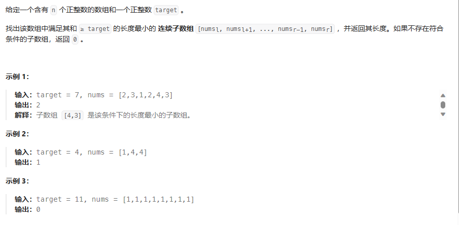

# 题目

## 解题思路1--暴力求解法
该方法时间复杂度较高，可能较难通过。
可以通过两次for循环，第二次for循环中加到刚好大于target时break，将该子数组长度与minLen进行比较。

## 解题思路2--滑动窗口法
该方法的时间复杂度为O(n)。有点类似与双指针的思想。对fastpointer进行遍历，计算slowpointer与fasterpointer中间的子数组之和，如果大于target则记录长度，并让slowpointer+1.