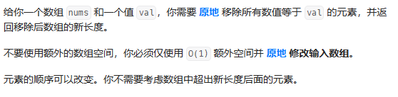
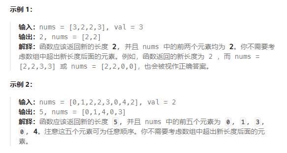

# 题目

## 解法一：暴力求解
由于数组在内存中是连续的，因此不能进行元素删除，只能覆盖。因此可以采用两层for循环，再第二个for循环中将后面的元素都往前挪一个，同时要对第一层的索引减1（防止后面一个元素也是需需要移除的），数组长度减1。

## 解法二： 双指针

    for (int fastpointer = 0; fastpointer < size; fastpointer++){
        if (nums[fastpointer] != val){
            nums[slowpointer++] = nums[fastpointer];
        }