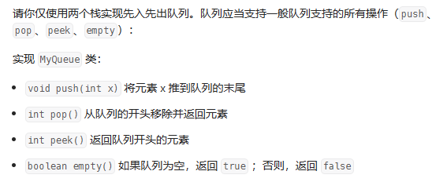

# 用栈实现队列MyQueue.cpp

## STL中栈的操作
```cpp
# include<stack>
stack<int> q;
q.push(1); //使元素入栈，时间复杂度O(1)
q.top(); //查询栈顶， 时间复杂度O(1)
q.pop(); //删除栈顶元素
q.empty(); //检验是否为空
q.size(); //查询栈内元素个数， 时间复杂度O(1)
```
