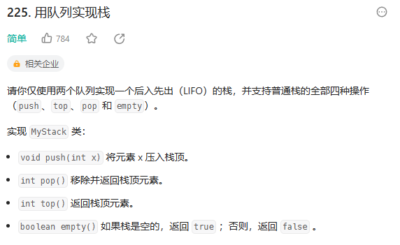

# 用栈实现队列MyQueue.cpp

## STL中栈的操作
```cpp
# include<stack>
stack<int> q;
q.push(1); //使元素入栈，时间复杂度O(1)
q.top(); //查询栈顶， 时间复杂度O(1)
q.pop(); //删除栈顶元素
q.empty(); //检验是否为空
q.size(); //查询栈内元素个数， 时间复杂度O(1)
```
# 用队列实现栈

## STL中队列的操作
```cpp
#include<queue>
queue<int> myQueue;
myQueue.push(10); //将元素插入队列的尾部
int element = myQueue.front(); // 访问队列的首元素
myQueue.pop(); //删除队列的首元素
myQueue.empty(); //检查队列是否为空
int size = myQueue.size(); //获取队列中元素的数量
```

# 有效的括号isValid.cpp

我们遍历给定的字符串 sss。当我们遇到一个左括号时，我们会期望在后续的遍历中，有一个相同类型的右括号将其闭合。由于后遇到的左括号要先闭合，因此我们可以将这个左括号放入栈顶。

当我们遇到一个右括号时，我们需要将一个相同类型的左括号闭合。此时，我们可以取出栈顶的左括号并判断它们是否是相同类型的括号。如果不是相同的类型，或者栈中并没有左括号，那么字符串s无效，返回 false。为了快速判断括号的类型，**我们可以使用哈希表存储每一种括号。哈希表的键为右括号，值为相同类型的左括号**。

# 逆波兰表达式求值

逆波兰表达式严格遵循「从左到右」的运算。计算逆波兰表达式的值时，使用一个栈存储操作数，从左到右遍历逆波兰表达式，进行如下操作：
1. 如果遇到操作数，则将操作数入栈；
2. 如果遇到运算符，则将两个操作数出栈，其中先出栈的是右操作数，后出栈的是左操作数，使用运算符对两个操作数进行运算，将运算得到的新操作数入栈。
整个逆波兰表达式遍历完毕之后，栈内只有一个元素，该元素即为逆波兰表达式的值。

# 滑动窗口最大值 maxSlidingWindow.cpp

## deque的用法
双端数组，可以对头端进行插入删除操作
### deque与vector的区别
1. vector对于头部的插入删除效率低，数据量越大，效率越低
2. deque相对而言，对头部的插入删除速度回比vector快
3. vector访问元素时的速度会比deque快,这和两者内部实现有关

```cpp
// 构造函数
deque<T> deqT; //默认构造形式
deque(beg, end); //构造函数将[beg, end)区间中的元素拷贝给本身。
deque(n, elem); //构造函数将n个elem拷贝给本身。
deque(const deque &deq); //拷贝构造函数
// 赋值操作
deque& operator=(const deque &deq); //重载等号操作符
assign(beg, end); //将[beg, end)区间中的数据拷贝赋值给本身。
assign(n, elem); //将n个elem拷贝赋值给本身。
// 大小操作
deque.empty(); //判断容器是否为空
deque.size(); //返回容器中元素的个数
deque.resize(num);
//重新指定容器的长度为num,若容器变长，则以默认值填充新位置。//如果容器变短，则末尾超出容器长度的元素被删除。
deque.resize(num, elem);
//重新指定容器的长度为num,若容器变长，则以elem值填充新位置。//如果容器变短，则末尾超出容器长度的元素被删除。
// 两端操作
push_back(elem); //在容器尾部添加一个数据
push_front(elem); //在容器头部插入一个数据
pop_back(); //删除容器最后一个数据
pop_front(); //删除容器第一个数据
// 指定位置操作
insert(pos,elem); //在pos位置插入一个elem元素的拷贝，返回新数据的位置。
insert(pos,n,elem); //在pos位置插入n个elem数据，无返回值。
insert(pos,beg,end); //在pos位置插入[beg,end)区间的数据，无返回值。
clear(); //清空容器的所有数据
erase(beg,end); //删除[beg,end)区间的数据，返回下一个数据的位置。
erase(pos); //删除pos位置的数据，返回下一个数据的位置。
// 数据存取
at(int idx); //返回索引idx所指的数据
operator[]; //返回索引idx所指的数据
front(); //返回容器中第一个数据元素
back(); //返回容器中最后一个数据元素
// 排序
sort(iterator beg, iterator end); //对beg和end区间内元素进行排序， 默认升序， 使用时需要包含algorithm
```

## 题解
对于「最大值」，我们可以想到一种非常合适的数据结构，那就是优先队列（堆），其中的大根堆可以帮助我们实时维护一系列元素中的最大值。
对于本题而言，初始时，我们将数组 nums 的前 k 个元素放入优先队列中。每当我们向右移动窗口时，我们就可以把一个新的元素放入优先队列中，此时堆顶的元素就是堆中所有元素的最大值。然而这个最大值可能并不在滑动窗口中，在这种情况下，这个值在数组 nums 中的位置出现在滑动窗口左边界的左侧。因此，当我们后续继续向右移动窗口时，这个值就永远不可能出现在滑动窗口中了，我们可以将其永久地从优先队列中移除。
我们不断地移除堆顶的元素，直到其确实出现在滑动窗口中。此时，堆顶元素就是滑动窗口中的最大值。为了方便判断堆顶元素与滑动窗口的位置关系，我们可以在优先队列中存储二元组 (num,index)，表示元素 nu 在数组中的下标为 index。
```cpp
class Solution {
public:
    vector<int> maxSlidingWindow(vector<int>& nums, int k) {
        int n = nums.size();
        priority_queue<pair<int, int>> q;
        for (int i = 0; i < k; ++i) {
            q.emplace(nums[i], i);
        }
        vector<int> ans = {q.top().first};
        for (int i = k; i < n; ++i) {
            q.emplace(nums[i], i);
            while (q.top().second <= i - k) {
                q.pop();
            }
            ans.push_back(q.top().first);
        }
        return ans;
    }
};
```

## 优先队列
优先级队列（priority_queue）其实，不满足先进先出的条件，更像是数据类型中的“堆”。**优先级队列每次出队的元素是队列中优先级最高的那个元素，而不是队首的元素**。这个优先级可以通过元素的大小等进行定义。比如定义元素越大优先级越高，那么每次出队，都是将当前队列中最大的那个元素出队。个人感觉这就是所谓“优先级”的定义。

```cpp
#include<queue>
// 定义
priority_queue<int> q;//储存int型数据 
priority_queue<double> q;//储存double型数据 
priority_queue<string> q;//储存string型数据 
priority_queue<结构体名> q;//储存结构体或者类 
```