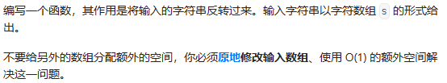
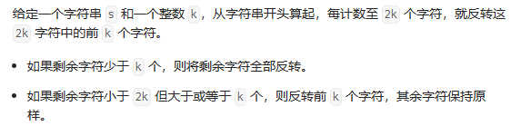
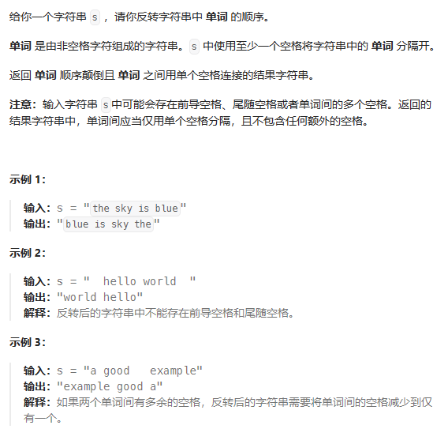
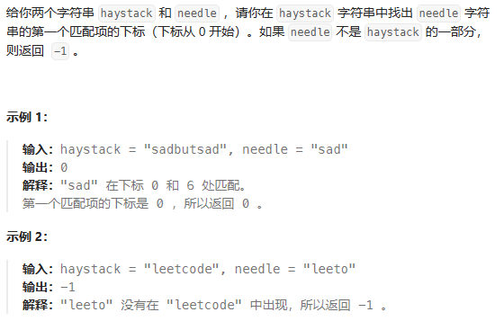

# 反转字符串reverseString


# 反转字符串II reverseStr


# 反转字符串中的单词


字符串的一些操作：
```cpp
string.length(); //返回的是无符号数，一般用作返回一个序列的长度
string.size();   //返回的是无符号数，一般用作返回容器大小的方法
string.substr(pos, len);  //提取从位置 `pos` 开始的长度为 `len` 的子串。如果不指定 `len`，则默认提取从 `pos` 到字符串末尾的所有字符。返回的是一个新的 `std::string` 对象
``````

# 找出字符串中第一个匹配项的下标strStr


