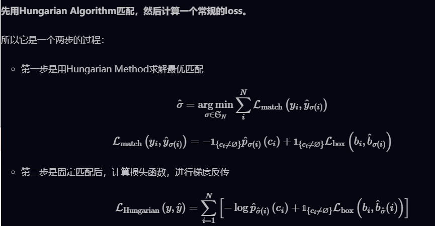

# CNN

### 卷积计算实现

```Python
def conv_forward_naive(x, w, b, conv_param):
    """
    Input:
    - x: Input data of shape (N, C, H, W)
    - w: Filter weights of shape (F, C, HH, WW)
    - b: Biases, of shape (F,)
    - conv_param: A dictionary with the following keys:
      - 'stride': The number of pixels between adjacent receptive fields in the
        horizontal and vertical directions.
      - 'pad': The number of pixels that will be used to zero-pad the input. 
    Returns a tuple of:
    - out: Output data, of shape (N, F, H', W') where H' and W' are given by
      H' = 1 + (H + 2 * pad - HH) / stride
      W' = 1 + (W + 2 * pad - WW) / stride
    - cache: (x, w, b, conv_param)
    """
    stride = conv_param['stride']
    pad = conv_param['pad']
    
    N, C, H, W = x.shape
    F, C, HH, WW = w.shape
    H_ = int((H + 2*pad - HH)/stride + 1)
    W_ = int((W + 2*pad - WW)/stride + 1)
    out = np.zeros((N, F, H_, W_))
    
    x_pad = np.pad(x, ((0, 0), (0, 0), (pad, pad), (pad, pad)), 'constant', constant_values = 0)

    for f in range(F):
        for i in range(H_):
            for j in range(W_):
                x_conv = x_pad[:, :, i*stride:(i*stride + HH), j*stride:(j*stride + WW)]*w[f, :, :, :]
                out[:, f, i, j] = np.sum(x_conv, axis = (1,2,3), keepdims = False)+b[f]
    cache = (x, w, b, conv_param)
    return out, cache

def conv_forward_im2col(x, w, b, conv_param):
    """
    A fast implementation of the forward pass for a convolutional layer
    based on im2col and col2im.
    """
    N, C, H, W = x.shape
    num_filters, _, filter_height, filter_width = w.shape
    stride, pad = conv_param['stride'], conv_param['pad']

    # Check dimensions
    assert (W + 2 * pad - filter_width) % stride == 0, 'width does not work'
    assert (H + 2 * pad - filter_height) % stride == 0, 'height does not work'

    # Create output
    out_height = (H + 2 * pad - filter_height) // stride + 1
    out_width = (W + 2 * pad - filter_width) // stride + 1
    out = np.zeros((N, num_filters, out_height, out_width), dtype=x.dtype)

    # x_cols = im2col_indices(x, w.shape[2], w.shape[3], pad, stride)
    x_cols = im2col_cython(x, w.shape[2], w.shape[3], pad, stride)
    res = w.reshape((w.shape[0], -1)).dot(x_cols) + b.reshape(-1, 1)

    out = res.reshape(w.shape[0], out.shape[2], out.shape[3], x.shape[0])
    out = out.transpose(3, 0, 1, 2)

    cache = (x, w, b, conv_param, x_cols)
    return out, cache
```


### 卷积有什么特点

1. **局部连接：**比起全连接，局部连接会大大减少网络的参数。在二维图像中，局部像素的关联性很强，设计局部连接保证了卷积网络对图像局部特征的强响应能力。
2. **权值共享：**参数共享也能减少整体参数量，增强了网络训练的效率。一个卷积核的参数权重被整张图片共享，不会因为图像内位置的不同而改变卷积核内的参数权重。

3. **下采样：**下采样能逐渐降低图像分辨率，实现了数据的降维，并使浅层的局部特征组合成为深层的特征。下采样还能使计算资源耗费变少，加速模型训练，也能有效控制过拟合。


### 不同层次的卷积都提取什么类型的特征？

1. 浅层卷积 →→ 提取边缘特征
2. 中层卷积 →→ 提取局部特征
3. 深层卷积 →→ 提取全局特征


### 卷积核大小如何选取

最常用的是3∗∗3大小的卷积核，两个3∗3卷积核和一个5∗5卷积核的感受野相同，但是减少了参数量和计算量，加快了模型训练。与此同时由于卷积核的增加，模型的非线性表达能力大大增强。

大卷积核在图像超分辨率领域有较多应用，因为它们可以提供更好的上下文信息、更好的特征提取能力，减少伪影效应的发生。


### 增大感受野的方法

1. 使用空洞卷积
2. 使用池化层
3. 增大卷积核


### 1*1卷积核的作用

1. 实现特征信息的交互和整合；
2. 对特征图通道数进行升维和降维；
3. 1*1卷积与激活函数可以增加非线性，提升网络表达能力；


### 转置卷积

转置卷积**通过训练过程学习到最优的上采样方式**，来代替传统的插值上采样方法，以提升图像分割，图像融合，GAN等特定任务的性能。转置卷积并不是卷积的反向操作，从信息论的角度看，卷积运算是不可逆的。转置卷积可以**将输出的特征图尺寸恢复卷积前的特征图尺寸，但不恢复原始数值**。


### 空洞卷积

空洞卷积的作用是在不进行池化操作损失信息的情况下，增大感受野，让每个卷积输出都包含较大范围的信息。空洞卷积有一个参数可以设置dilation rate，其**在卷积核中填充dilation rate个0**，因此，当设置不同dilation rate时，感受野就会不一样，也获取了多尺度信息。


### 全连接层的作用

1. **特征整合与提取**：全连接层接收前面卷积层或池化层提取到的特征图（或向量），通过权重矩阵的线性变换，将这些特征整合到一个全局特征向量中。这种全连接的结构允许网络学习将特征在不同层级之间相互关联起来，从而更好地理解输入数据。
2. **非线性变换**：在特征整合后，全连接层通常会应用非线性激活函数，如ReLU（Rectified Linear Unit）或Sigmoid函数，以引入非线性变换。这有助于网络学习更复杂的数据模式和特征，提高模型的表达能力。
3. **分类与预测**：全连接层的输出通常用于进行分类或预测。在分类任务中，全连接层的输出通过Softmax函数进行归一化，得到每个类别的概率分布；在回归任务中，全连接层的输出可以直接作为预测值。
4. **参数优化**：全连接层是可以学习的参数之一，通过反向传播算法，网络可以自动调整全连接层中的权重参数，以最小化损失函数，从而使模型在训练数据上达到更好的拟合效果。


### 池化层的作用

池化层的作用是对感受野内的特征进行选择，提取区域内最具代表性的特征，能够有效地减少输出特征数量，进而减少模型参数量。


### 全局池化的作用

1. 代替全连接层，降低参数量。
2. 减少过拟合，增加泛化能力。


### 提升模型泛化能力的方法

1. 采集更多数据：数据决定算法的上限。
2. 优化数据分布：数据类别均衡。
3. 选用合适的目标函数。
4. 设计合适的网络结构。
5. 数据增强。
6. 权值正则化。
7. 使用合适的优化器等。


### BN解决了什么问题

神经网络在做非线性变换前的激活输入值随着网络深度加深，其分布逐渐发生偏移，整体分布逐渐往非线性函数的取值区间的上下限两端靠近，导致**反向传播时低层神经网络的梯度消失**，这是训练深层神经网络收敛越来越慢的本质原因。BN就是通过一定的正则化手段，把每层神经网络任意神经元这个输入值的分布强行拉回到均值为0方差为1的标准正态分布。所以**BN解决了梯度消失的问题，加速了训练过程**。


### BN训练和测试有什么不同

在训练阶段，BN层是对每个batch的训练数据进行标准化，即用每一批数据的均值和方差来进行标准化操作。

而在测试阶段，我们一般只输入一个测试样本，并没有batch的概念。因此这个时候用的均值和方差是整个数据集训练后的均值和方差，可以通过**滑动平均法**求得。


### BN为什么不用整个训练集的均值和方差

不同batch数据的均值和方差会有一定的差别，而不是固定的值，这个差别能够增加模型的鲁棒性，也会在一定程度上减少过拟合。


### BN层用在哪里

在CNN中，BN层应该用在非线性激活函数前面。由于神经网络隐藏层的输入是上一层非线性激活函数的输出，在训练初期其分布还在剧烈改变，此时约束其一阶矩和二阶矩无法很好地缓解 Covariate Shift；而BN的分布更接近正态分布，限制其一阶矩和二阶矩能使输入到激活函数的值分布更加稳定。


### BN层的参数量

$$
x=\gamma \frac{x-\mu}{\sqrt{\sigma^2+\epsilon}} +\beta
$$

因此BN层的参数量时$2C$


### BN层的优点与缺点

**优点：**

1. 可以选择较大的初始学习率。因为这个算法收敛很快。
2. 可以不用dropout，L2正则化。
3. 不需要使用局部响应归一化。
4. 可以把数据集彻底打乱。
5. 模型更加健壮。

**缺点：**

1. Batch Normalization非常依赖Batch的大小，当Batch值很小时，计算的均值和方差不稳定。
2. 所以BN不适用于以下几个场景：小Batch，RNN等。


### 分组卷积

分组卷积（Group Convolution）最早出现在AlexNet网络中，分组卷积被用来切分网络，使其能在多个GPU上并行运行。分组卷积的主要**对输入的feature map进行分组**，然后每组分别进行卷积。如果分成G个group，那么总的参数量减少为原来的$\frac{1}{G}$

**作用：**

1. 减少参数量
2. 分组卷积可以看成是稀疏操作，有时可以在较少参数量的情况下获得更好的效果（相当于正则化操作）。


### Spectral Normalization

Spectral Normalization是一种wegiht Normalization技术，和weight-clipping以及gradient penalty一样，也是让模型满足1-Lipschitz条件的方式之一。

Lipschitz条件约束为：
$$
\frac{||f(x)-f(x')||_2}{||x-x'||_2} < K
$$
Lipschitz（利普希茨）条件限制了函数变化的剧烈程度，即函数的梯度，来确保统计的有界性。因此函数更加平滑，在神经网络的优化过程中，参数变化也会更稳定，**不容易出现梯度爆炸**。

Spectral Normalization实际上在做的事，是**将每层的参数矩阵除以自身的最大奇异值.**


### 讲一讲常见的激活函数和优缺点

**激活函数可以引入非线性因素，提升网络的学习表达能力。**

1. **Sigmoid 函数**：$\sigma(x)=\frac{1}{1+e^{-x}}$​

   优点：1.输出范围在 (0, 1) 之间，可以用于二分类问题的输出；2. 具有良好的导数性质，易于求导。

   缺点：1. Sigmoid 函数的梯度在接近饱和区域时会变得很小，导致梯度消失问题；2 . 执行指数运算，计算机运行得较慢。3. 函数输出不是以 0 为中心的，会导致后层的神经元的输入是非0均值的信号，这会降低权重更新的效率；

2. ReLU函数： $f(x)=max(0, x)$

   优点：1. 计算简单，只需比较输入是否大于零。2. 在正数区间上不存在梯度消失问题，能够加速模型的收敛。

   缺点：1. 在负数区间上输出为零，可能导致神经元死亡，因为ReLU在x<0时梯度为0，这样就导致梯度被清零了; 2. 函数输出不是以 0 为中心的，这会降低权重更新的效率；

3. Tanh函数：$f{x}=\frac{2}{1+e^{-2x}}-1$

​	优点：1. 输出以零为中心，有助于缓解梯度消失问题。2. 输出以零为中心

​	缺点：1. 仍然存在梯度消失问题，特别是在接近饱和区域时。

4. Softmax函数: $f(x)=\frac{e^{x_i}}{\sum_{i=1}^ne^{x_j}}$

​	优点： 适用于多类别分类问题，可以将网络输出转换为概率分布。

​	缺点： 求解过程中可能会受到数值稳定性的影响，特别是当输入较大或较小时。


## 神经网络优化器有哪些

### SGD（随机梯度下降）

最基本的优化算法之一，每次迭代随机选择一批样本进行梯度计算和参数更新。虽然简单，但在实践中可能会受到局部极小值、学习率调整等问题的影响。
$$
\theta=\theta -\eta \nabla_{\theta}J(\theta;x;y)
$$
动量：
$$
v_t = \gamma v_{t-1}+\eta \nabla_{\theta}J(\theta)
$$

$$
\theta=\theta - v_t
$$


### AdaGrad(自适应梯度)

 自适应学习率的方法之一，通过**对每个参数的学习率进行适应性调整**，使得稀疏梯度对应的学习率较大，而频繁出现的梯度对应的学习率较小。
$$
g_{t,i}=\nabla_\theta J(\theta_i)
$$

$$
\theta_{t+1,i}=\theta_{t,i}-\frac{\eta}{\sqrt{G_{t,ii}+\epsilon}}g_{t,i}
$$

$G_{t,ii}$表示t时刻参数$\theta_i$梯度的平方法。繁更新的梯度，则累积的分母逐渐偏大，那么更新的步长相对就会变小，而稀疏的梯度，则导致累积的分母项中对应值比较小，那么更新的步长则相对比较大。


### RMSProp

RMSProp结合梯度平方的指数移动平均来更新梯度的方向，结合AdaGrad来调整每个参数的学习率。


### Adam

结合了AdaGrad和RMSProp两种优化算法的优点。对梯度的一阶矩估计（First Moment Estimation，即梯度的均值）和二阶矩估计（Second Moment Estimation，即梯度的未中心化的方差）进行综合考虑，计算出更新步长。
$$
g_t=\nabla_\theta J(\theta_{t-1})
$$

$$
m_t=\beta_1m_{t-1}+(1-\beta_1)g_t
$$

$$
v_t=\beta_2v_{t-1}+(1-\beta_2)g_t
$$

$$
\hat m_t = m_t / (1-\beta_1^t)
$$

$$
\hat v_t=v_t/(1-\beta_2^t)
$$

$$
\theta_t=\theta_{t-1}-\alpha \hat m_t / (\sqrt{\hat v_t}+\epsilon)
$$


# 经典模型&&算法

### 计算IOU

```python
def calculate_iou(box_1, box_2):
    """
    calculate iou
    :param box_1: (x0, y0, x1, y1)
    :param box_2: (x0, y0, x1, y1)
    :return: value of iou
    """
    # calculate area of each box
    area_1 = (box_1[2] - box_1[0]) * (box_1[3] - box_1[1])
    area_2 = (box_2[2] - box_2[0]) * (box_1[3] - box_1[1])
 
    # find the edge of intersect box
    top = max(box_1[0], box_2[0])
    left = max(box_1[1], box_2[1])
    bottom = min(box_1[3], box_2[3])
    right = min(box_1[2], box_2[2])
 
    # if there is an intersect area
    if left >= right or top >= bottom:
        return 0
 
    # calculate the intersect area
    area_intersection = (right - left) * (bottom - top)
 
    # calculate the union area
    area_union = area_1 + area_2 - area_intersection
 
    iou = float(area_intersection) / area_union
 
    return iou
```


### 目标检测中AP,AP50,AP75,mAP的指标含义

AP：PR曲线下的面积。

AP50: 固定IoU为50%时的AP值。

AP75:固定IoU为75%时的AP值。

AP@[0.5:0.95]:把IoU的值从50%到95%每隔5%进行了一次划分，并对这10组AP值取平均。

mAP：对所有的类别进行AP的计算，然后取均值。


### 介绍NMS及其变体

1. Soft-NMS：通过降低重叠边界框的置信度来保留更多信息，将其得分进行惩罚衰减


### NMS的缺点及其改进工作

```python
# 很多检测框都是检测同一个目标，但最终每个目标只需要一个检测框，NMS选择那个得分最高的检测框
import numpy as np

def calculate_iou(box1, box2):
    """
    计算两个边界框的交并比（IoU）
    """
    # 提取边界框的坐标
    x1_tl, y1_tl, x1_br, y1_br = box1
    x2_tl, y2_tl, x2_br, y2_br = box2

    # 计算交集的坐标
    x_intersection = max(0, min(x1_br, x2_br) - max(x1_tl, x2_tl))
    y_intersection = max(0, min(y1_br, y2_br) - max(y1_tl, y2_tl))
    intersection = x_intersection * y_intersection

    # 计算并集的面积
    area_box1 = (x1_br - x1_tl) * (y1_br - y1_tl)
    area_box2 = (x2_br - x2_tl) * (y2_br - y2_tl)
    union = area_box1 + area_box2 - intersection

    # 计算交并比
    iou = intersection / union
    return iou

def non_max_suppression(boxes, scores, threshold):
    """
    非极大值抑制算法
    """
    # 按照置信度排序
    sorted_indices = np.argsort(scores)[::-1]
    selected_indices = []

    while len(sorted_indices) > 0:
        # 选择置信度最高的边界框
        best_index = sorted_indices[0]
        selected_indices.append(best_index)

        # 计算当前边界框与其余边界框的IoU
        ious = [calculate_iou(boxes[best_index], boxes[idx]) for idx in sorted_indices[1:]]

        # 移除与当前边界框IoU大于阈值的边界框
        remove_indices = np.where(np.array(ious) > threshold)[0] + 1
        sorted_indices = np.delete(sorted_indices, remove_indices)

    return selected_indices
```

##### 缺点：

1. 参数敏感：NMS的性能受到参数的影响，不同的数据集和场景可能需要不同的参数设置。
2. 计算开销： 在大规模数据集上运行NMS可能会消耗大量的计算资源
3. 抑制不完全：NMS可能会错误地移除真实目标边界框，特别是当目标之间有部分遮挡或重叠时。
4. 处理不规则目标困难：对于不规则形状或大小不一的目标，NMS的效果可能不理想。
5. 将相邻检测框的分数均强制归零

改进方法：

1. Soft-NMS：通过降低重叠边界框的置信度来保留更多信息，将其得分进行惩罚衰减


### One-Stage目标检测与two-stage目标检测的区别

**Two-stage目标检测算法：**先进行区域生成（region proposal，RP）（一个有可能包含待检物体的预选框），再通过卷积神经网络进行样本分类。其**精度较高，速度较慢**。

主要逻辑：特征提取—>生成RP—>分类/定位回归。

常见的Two-stage目标检测算法有：Faster R-CNN系列和R-FCN等。

**One-stage目标检测算法：**不用RP，直接在网络中提取特征来预测物体分类和位置。其速度较快，精度比起Two-stage算法稍低。

主要逻辑：特征提取—>分类/定位回归。

常见的One-stage目标检测算法有：YOLO系列、SSD和RetinaNet等。


### 提升小目标检测的效果

1. **提高图像分辨率：**小目标在边界框中可能只包含几个像素，那么能通过提高图像的分辨率以增加小目标的特征的丰富度。

2. **提高模型的输入分辨率：**这是一个效果较好的通用方法，但是会带来模型inference速度变慢的问题。

3. **数据增强：**小目标检测增强包括随机裁剪、随机旋转和镶嵌增强等。

4. 自动学习anchor
5. 类别优化


### ResNet模型的特点以及解决的问题

ResNet就是一个差分放大器。ResNet的结构设计，思想逻辑，就是在机器学习中抽象出了一个差分放大器，其能让深层网络的梯度的相关性增强，在进行梯度反传时突出微小的变化。


### MobileNet v1

MobileNetv1网络结构在VGG的基础上使用**depthwise Separable卷积**，在保证不损失太大精度的同时，大幅降低模型参数量。


### MobieNet v2

MobileNetV2使用**Linear Bottleneck(线性变换)来代替原本的非线性激活函数**，来捕获感兴趣的流形。实验证明，使用Linear Bottleneck可以在小网络中较好地保留有用特征信息。


### MobileNet v3

1.互补搜索技术组合：由资源受限的NAS执行模块级搜索；由NetAdapt执行局部搜索，对各个模块确定之后网络层的微调。

2.网络结构改进：进一步减少网络层数，并引入h-swish激活函数。


### YOLOv2中的anchor是如何生成的

YOLOv2中引入K-means算法进行anchor的生成，可以自动找到更好的anchor宽高的值用于模型训练的初始化。由于目标检测中主要关心anchor与GT的IOU，不关心两者的大小。因此，**使用IOU作为度量**更加合适，即提高IOU值。


### faster rcnn 和 yolo

two-stage,首先产生候选区域，然后对位置精修后进行候选区域分类。two-stage检测算法识别错误率低，漏识别率也较低，但速度较慢，不能满足实时检测场景，比如视频目标检测中。

one-stage检测算法不需要产生候选区域阶段，直接产生物体的类别概率和位置坐标值，经过单次检测即可直接得到最终的检测结果，因此有着更快的检测速度，但是一般识别精度和准确度上比two-stage的算法要差一些。

单阶段的正负样本太不均衡，两阶段的会划分正负样本均匀化。


### 目标检测中，单双阶段分别目的是什么？

单阶段检测器旨在通过单个神经网络模型直接检测图像中的目标，而不需要额外的区域提议生成步骤。因此，它们的主要目的是简化检测流程，提高检测速度。

双阶段检测器的主要目的是提高检测的准确性，即在保持较高准确率的同时，可能牺牲一些检测速度。它们通常包含两个主要阶段：生成候选区域和对候选区域进行分类与回归。


### FPN（Feature Pyramid Network）网络

用于解决目标检测中的**多尺度问题**，在基本不增加原有模型计算量的情况下，大幅度**提升小物体（small object）的检测性能**。低层的特征语义信息比较少，但是目标位置准确,这是对小目标检测有帮助的。FPN**将高层特征与底层特征进行融合**，从而同时利用低层特征的高分辨率和高层特征的丰富语义信息，并进行了多尺度特征的独立预测，对小物体的检测效果有明显的提升。

**框集合并与非极大值抑制：**从所有尺度生成的所有预测框中，通常会进行框集合并操作。随后，应用非极大抑制（Non-Maximum Suppression, NMS）算法来去除冗余的预测框。


### RPN（Region Proposal Network）网络


1. 生成Anchor： 特征图中的每一个点都是一个anchor，每个anchor中有9中不同大小和宽高比的预设anchor box；
2. FPN利用一个3*3的卷积核得到一个256维度的向量，分别通过全连接层降维成2×9与4×9维，通过softmax进行二分类已经边框回归来使得anchor box更接近ground truth；


### SPP(Spatial Pyramid Pooling)

在目标检测领域，很多检测算法最后使用了全连接层，导致输入尺寸固定。当遇到尺寸不匹配的图像输入时，就**需要使用crop或者warp等操作进行图像尺寸和算法输入的匹配**。导致：**裁剪的区域可能没法包含物体的整体；变形操作造成目标无用的几何失真等。**

SPP的做法是在卷积层后增加一个SPP layer，**将features map拉成固定长度的feature vector**。然后将feature vector输入到全连接层中。

**优点：**

1. SPP可以忽略输入尺寸并且产生固定长度的输出。

2. SPP使用多种尺度的滑动核，而不是只用一个尺寸的滑动窗口进行pooling。

3. SPP在不同尺寸feature map上提取特征，增大了提取特征的丰富度。


### Faster RCNN 中检测的网络如何适应不同的框的大小？

1. 采用了一种称为金字塔特征金字塔（Feature Pyramid Network，FPN）的技术。FPN 是一种多尺度特征图提取方法，可以在不同层级上生成具有不同分辨率的特征图，使模型能够在多个尺度下进行检测。
2. 预设了3中不同大小宽高的anchor box；


### 为什么UNet在医学图像上表现这么好

1. 医学图像语义较为简单、结构较为固定。所以高级语义信息和低级特征都显得很重要(UNet的skip connection和[U型结构](https://www.zhihu.com/search?q=U型结构&search_source=Entity&hybrid_search_source=Entity&hybrid_search_extra={"sourceType"%3A"answer"%2C"sourceId"%3A586501606})就派上了用场)。
2. .数据量少。医学影像的数据获取相对难一些，很多比赛只提供不到100例数据。所以我们设计的模型不宜多大，参数过多，很容易导致[过拟合](https://www.zhihu.com/search?q=过拟合&search_source=Entity&hybrid_search_source=Entity&hybrid_search_extra={"sourceType"%3A"answer"%2C"sourceId"%3A586501606})。


# Transformer

### 常见的注意力机制

1. SE模块

```python
class SELayer(nn.Module):
    def __init__(self, channel, reduction=16):
        super(SELayer, self).__init__()
        self.avg_pool = nn.AdaptiveAvgPool2d(1)
        self.fc = nn.Sequential(
            nn.Linear(channel, channel // reduction, bias=False),
            nn.ReLU(inplace=True),
            nn.Linear(channel // reduction, channel, bias=False),
            nn.Sigmoid()
        )
 
    def forward(self, x):
        b, c, _, _ = x.size()
        y = self.avg_pool(x).view(b, c)
        y = self.fc(y).view(b, c, 1, 1)
        return x * y.expand_as(x)
```


2. CA模块

```python
import torch
from torch import nn
class CA_Block(nn.Module):
    def __init__(self, channel, h, w, reduction=16):
        super(CA_Block, self).__init__()
        self.h = h
        self.w = w
        self.avg_pool_x = nn.AdaptiveAvgPool2d((h, 1))
        self.avg_pool_y = nn.AdaptiveAvgPool2d((1, w))
        self.conv_1x1 = nn.Conv2d(in_channels=channel, out_channels=channel//reduction, kernel_size=1, stride=1, bias=False)
        self.relu = nn.ReLU()
        self.bn = nn.BatchNorm2d(channel//reduction)
        self.F_h = nn.Conv2d(in_channels=channel//reduction, out_channels=channel, kernel_size=1, stride=1, bias=False)
        self.F_w = nn.Conv2d(in_channels=channel//reduction, out_channels=channel, kernel_size=1, stride=1, bias=False)
        self.sigmoid_h = nn.Sigmoid()
        self.sigmoid_w = nn.Sigmoid()
    def forward(self, x):
        x_h = self.avg_pool_x(x).permute(0, 1, 3, 2)
        x_w = self.avg_pool_y(x)
        x_cat_conv_relu = self.relu(self.conv_1x1(torch.cat((x_h, x_w), 3)))
        x_cat_conv_split_h, x_cat_conv_split_w = x_cat_conv_relu.split([self.h, self.w], 3)
        s_h = self.sigmoid_h(self.F_h(x_cat_conv_split_h.permute(0, 1, 3, 2)))
        s_w = self.sigmoid_w(self.F_w(x_cat_conv_split_w))
        out = x * s_h.expand_as(x) * s_w.expand_as(x)
        return out
```


3. 自注意力机制：用于处理序列数据，如文本、语音等。它能够根据序列中各个元素之间的相互关系动态地计算每个元素的权重。

```python
import torch
import torch.nn as nn
import torch.nn.functional as F

class MultiHeadAttention(nn.Module):
    def __init__(self, embed_dim, num_heads):
        super(MultiHeadAttention, self).__init__()
        assert embed_dim % num_heads == 0, "Embedding dimension must be divisible by the number of heads."
        self.embed_dim = embed_dim
        self.num_heads = num_heads
        self.head_dim = embed_dim // num_heads

        # 初始化线性变换矩阵
        self.W_q = nn.Linear(embed_dim, embed_dim, bias=False)
        self.W_k = nn.Linear(embed_dim, embed_dim, bias=False)
        self.W_v = nn.Linear(embed_dim, embed_dim, bias=False)

        # 输出线性变换矩阵
        self.W_o = nn.Linear(embed_dim, embed_dim)

    def forward(self, query, key, value, mask=None):
        batch_size = query.shape[0]

        # 线性变换
        Q = self.W_q(query)  # 形状: (batch_size, seq_len, embed_dim)
        K = self.W_k(key)    # 形状: (batch_size, seq_len, embed_dim)
        V = self.W_v(value)  # 形状: (batch_size, seq_len, embed_dim)

        # 重塑为多头
        Q = Q.view(batch_size, -1, self.num_heads, self.head_dim).permute(0, 2, 1, 3)  # 形状: (batch_size, num_heads, seq_len, head_dim)
        K = K.view(batch_size, -1, self.num_heads, self.head_dim).permute(0, 2, 1, 3)  # 形状: (batch_size, num_heads, seq_len, head_dim)
        V = V.view(batch_size, -1, self.num_heads, self.head_dim).permute(0, 2, 1, 3)  # 形状: (batch_size, num_heads, seq_len, head_dim)

        # 计算注意力分数
        scores = torch.matmul(Q, K.transpose(-2, -1)) / torch.sqrt(torch.tensor(self.head_dim, dtype=torch.float32))
        if mask is not None:
            scores.masked_fill_(mask == 0, float('-inf'))

        # 使用 softmax 激活函数计算注意力权重
        attn_probs = F.softmax(scores, dim=-1)  # 形状: (batch_size, num_heads, seq_len, seq_len)

        # 使用注意力权重对值进行加权求和
        attn_output = torch.matmul(attn_probs, V)  # 形状: (batch_size, num_heads, seq_len, head_dim)

        # 拼接多头并投影回原始嵌入维度
        attn_output = attn_output.permute(0, 2, 1, 3).contiguous().view(batch_size, -1, self.embed_dim)  # 形状: (batch_size, seq_len, embed_dim)

        # 使用线性变换得到最终的注意力输出
        attn_output = self.W_o(attn_output)  # 形状: (batch_size, seq_len, embed_dim)

        return attn_output
```


3. 交叉注意力机制：用于处理具有不同输入的模型，如图像与文本之间的关系。它允许模型在处理不同输入时动态地计算各个输入之间的关联性，从而更好地整合不同输入的信息。


### self-attention的计算方式，为什么要除以根号dk


### LN和BN的区别


### 为什么Transformer要使用LayerNorm

归一化的公式：
$$
Norm(x)=\gamma\frac{x-\mu}{\sqrt{\sigma^2+\epsilon}}+\beta
$$
其中，$\gamma$和$\beta$是可学习的缩放和平移参数。

BatchNorm中：
$$
\mu=\frac{1}{m}\sum_{i=1}^mx^i
$$

$$
\sigma^2=\frac{1}{m}\sum_{i=1}^m(x^i-\mu)^2
$$

其中，m是批量样本的大小，$x^i$是第$i$个样本的输出；把一个batch中同一个通道的所有特征是为一个分布（有几个通道就有几个分布），并将其标准化，这意味着：不同图片的的同一通道的相对关系是保留的，即不同图片的同一通达的特征是可以比较的；同一图片的不同通道的特征则是失去了可比性；

LayerNorm中：
$$
\mu=\frac{1}{n}\sum_{i=1}^nx_i
$$

$$
\sigma^2=\frac{1}{n}\sum_{i=1}^n(x_i-\mu)^2
$$

其中，$n$ 是特征的维度，$x_i$是第$i$ 个特征的值。把一个句子的所有词向量视为一个分布（有几个句子就有几个分布），并将其归一化。这意味着：同一个句子中的词向量的相对大小是保留的；不同句子的词向量失去了可比性。


任何norm的意义都是为了让使用norm的网络的输入的数据分布变得更好，也就是转换为标准正态分布，数值进入敏感度区间，以减缓梯度消失，从而更容易训练。当然，这也意味着舍弃了除此维度之外其他维度的其他信息。首先要明确，如果在一个维度内进行normalization，那么在这个维度内，相对大小有意义的，是可以比较的；但是在normalization后的不同的维度之间，相对大小这是没有意义的。

相比于稳定前向输入分布，反向传播时mean和variance计算引入的梯度更有用，可以稳定反向传播时loss对输入的梯度。LN特别适合处理变长数据，因为是对channel维度做操作(这里指NLP中的hidden维度)，和句子长度和batch大小无关。

自己的理解：不同句子之间的词向量不需要有可比较的关系；


### 为什么self-attention可以堆叠多层，有什么作用

Self-attention（自注意力）能够捕捉输入序列中的长距离依赖关系，通过堆叠多层self-attention，模型可以学习序列中更深层次的模式和依赖关系。多层self-attention就像神经网络中的多个隐藏层一样，使模型能够学习和表示更复杂的函数。


### Transformer与CNN的优缺点

**Transformer 的优点：**

1. **适用于序列数据：** Transformer 主要应用于处理序列数据，如自然语言处理（NLP）任务中的文本序列。由于其自注意力机制的引入，Transformer 能够捕获序列中任意两个位置之间的依赖关系，从而更好地建模长距离依赖。
2. **并行计算：** Transformer 的自注意力机制允许每个位置的输入直接和所有其他位置的输入进行交互，使得模型在处理长序列时具有较好的并行性，能够高效地利用硬件资源。
3. **位置编码：** Transformer 使用位置编码来表示输入序列中的位置信息，这使得模型能够区分不同位置的词或符号，有助于模型理解序列的顺序信息。
4. **可解释性：** Transformer 模型的自注意力机制使得模型在生成预测时能够关注输入序列中的不同部分，从而具有一定的可解释性，可以分析模型在做出决策时的注意力分布情况。

**Transformer 的缺点：**

1. **计算复杂度高：** Transformer 模型通常需要较大的参数量，且在处理长序列时，由于自注意力机制的全连接特性，计算复杂度较高，可能导致训练和推理速度较慢。
2. **数据量要求高：** Transformer 模型通常需要大量的数据来进行训练，特别是在没有预训练模型的情况下，需要更多的数据来学习到有效的表示。

**CNN 的优点：**

1. **适用于图像数据：** CNN 主要应用于处理图像数据，具有良好的特征提取能力，能够捕获图像中的局部特征和层次结构。
2. **参数共享和稀疏连接：** CNN 中的卷积层具有参数共享和稀疏连接的特性，这使得模型具有较少的参数量和更高的参数效率，适合处理大规模图像数据。
3. **平移不变性：** CNN 中的卷积操作具有平移不变性，即对图像的平移操作具有一定的鲁棒性，能够在一定程度上保持对图像中相同特征的识别能力。

**CNN 的缺点：**

1. **局限于固定大小的输入：** CNN 在处理图像时通常需要固定大小的输入，因此对于尺寸不一致的图像数据需要进行预处理或者裁剪，可能会丢失一部分信息。
2. **不适用于序列数据：** CNN 不适用于处理序列数据，因为其卷积操作是基于固定大小的局部感受野进行的，无法捕获序列中不同位置之间的依赖关系。

### Transformer 中的位置编码在哪实现的？是固定的，还是可以学习？

位置编码通常被加到输入嵌入之后，以将位置信息与词嵌入结合起来，从而使模型能够区分不同位置的词。

一种常用的位置编码方法是使用正弦和余弦函数的组合：
$$
PE(pos, 2i)=sin(pos/10000^{2i/d_{model}})
$$

$$
PE(pos,2i+1)=cos(pos/10000^{2i/d_{model}})
$$


### 多头注意力机制和单头相比有什么优势

多头注意力机制可以同时关注输入的不同部分，并在不同的表示空间中学习到不同的表示。这使得模型能够更好地捕捉输入序列的局部和全局信息，提高了表示的丰富性和多样性；多头的本质是多个独立的attention计算，作为一个集成的作用，防止过拟合，因为每个头都可以学习到不同的关注点，从而减少了对单个注意力头的过度依赖；


### 多头注意力机制的计算复杂度

矩阵乘法的复杂度：假设A是$n×m$的矩阵，$B$是$m×p$的矩阵，那么$A×B$的复杂度为`O(mnp)`

1. 对于$n×d$和$d×n$的矩阵$Q$,$K^T$，矩阵相乘的复杂度为$O(n^2d)$​
2. softmax函数：$O(n^2)$
3. 加权平均：矩阵相乘，$O(n^2d)$

所以自注意力机制的计算复杂度为$O(n^2d)$

多头注意力机制的计算复杂度为$O(mn^2h)=O(n^2d)$


### Transformer中的head为什么要降维？

就是希望每个注意力头，只关注最终输出序列中一个子空间，互相**独立**。其核心思想在于，抽取到更加丰富的**特征信息**。在**不增加时间复杂度**的情况下，同时，借鉴**[CNN](https://www.zhihu.com/search?q=CNN&search_source=Entity&hybrid_search_source=Entity&hybrid_search_extra={"sourceType"%3A"answer"%2C"sourceId"%3A1718672303})多核**的思想，在**更低的维度**，在**多个独立的[特征空间](https://www.zhihu.com/search?q=特征空间&search_source=Entity&hybrid_search_source=Entity&hybrid_search_extra={"sourceType"%3A"answer"%2C"sourceId"%3A1718672303})**，**更容易**学习到更丰富的[特征信息](https://www.zhihu.com/search?q=特征信息&search_source=Entity&hybrid_search_source=Entity&hybrid_search_extra={"sourceType"%3A"answer"%2C"sourceId"%3A1718672303})。


### ViT 结构

但是当训练数据集不够大的时候，ViT的表现通常比同等大小的ResNets要差一些，因为Transformer和CNN相比缺少归纳偏置（inductive bias），即一种先验知识，提前做好的假设。CNN具有两种归纳偏置，一种是局部性（locality/two-dimensional neighborhood structure），即图片上相邻的区域具有相似的特征；一种是平移不变形（translation equivariance）。

ViT将输入图片分为多个patch（16x16），再将每个patch投影为固定长度的向量送入Transformer。对图片分类，因此在输入序列中加入一个特殊的token，该token对应的输出即为最后的类别预测。

**patch embedding：**输入图片大小为224x224，将图片分为固定大小的patch，patch大小为16x16，则每张图像会生成224x224/16x16=196个patch，即输入序列长度为**196**，每个patch维度16x16x3=**768**，线性投射层的维度为768xN (N=768)，因此输入通过线性投射层之后的维度依然为196x768，即一共有196个token，每个token的维度是768。还需要加上一个特殊字符cls，因此最终的维度是**197x768**。到目前为止，已经通过patch embedding将一个视觉问题转化为了一个seq2seq问题。

**positional embedding：**位置编码可以理解为一张表，表一共有N行，N的大小和输入序列长度相同，每一行代表一个向量，向量的维度和输入序列embedding的维度相同（768）。

1-D 位置编码：例如3x3共9个patch，patch编码为1到9

2-D 位置编码：patch编码为11,12,13,21,22,23,31,32,33，即同时考虑X和Y轴的信息，每个轴的编码维度是D/2

**图片大小：**当输入图片分辨率发生变化，输入序列的长度也发生变化，虽然ViT可以处理任意长度的序列，但是预训练好的位置编码无法再使用。一种做法是使用插值算法，扩大位置编码表。但是如果序列长度变化过大，插值操作会损失模型性能，这是ViT在微调时的一种局限性


### CV和NLP的位置编码的区别


### 如果position embedding变成concat会有什么影响


### Transformer的复杂度


### DETR中匈牙利匹配算法的具体流程

DETR不需要NMS，采用的是集合预测损失。在DETR中固定会输出N个预测框，如何将预测框与GT对应起来？

二分匹配问题：找到一组边集合，这组边集合没有公共的顶点。

例子：N个工人，M个任务，每个工人对应不同任务的价钱不同，如何以最小的代价完成任务。



第一步，构建匹配代价$L_{match}$​​​来进行匈牙利算法的最优分配，其中考虑了Ground truth与预测框之间的类别预测以及距离的代价；第二步，对前一步中匹配的所有配对的匈牙利损失，这个损失函数为类预测的负对数似然和边界框损失的线性组合。


### 实例的匹配问题

```python
    def pair_coordinates(setA, setB, radius):
        """Use the Munkres or Kuhn-Munkres algorithm to find the most optimal
        unique pairing (largest possible match) when pairing points in set B
        against points in set A, using distance as cost function.
        Args:
            setA, setB: np.array (float32) of size Nx2 contains the of XY coordinate
                        of N different points
            radius: valid area around a point in setA to consider
                    a given coordinate in setB a candidate for match
        Return:
            pairing: pairing is an array of indices
            where point at index pairing[0] in set A paired with point
            in set B at index pairing[1]
            unparedA, unpairedB: remaining poitn in set A and set B unpaired
        """
        # * Euclidean distance as the cost matrix
        pair_distance = scipy.spatial.distance.cdist(setA, setB, metric='euclidean')

        # * Munkres pairing with scipy library
        # the algorithm return (row indices, matched column indices)
        # if there is multiple same cost in a row, index of first occurence
        # is return, thus the unique pairing is ensured
        indicesA, paired_indicesB = linear_sum_assignment(pair_distance)

        # extract the paired cost and remove instances
        # outside of designated radius
        pair_cost = pair_distance[indicesA, paired_indicesB]

        pairedA = indicesA[pair_cost <= radius]
        pairedB = paired_indicesB[pair_cost <= radius]

        pairing = np.concatenate([pairedA[:, None], pairedB[:, None]], axis=-1)
        unpairedA = np.delete(np.arange(setA.shape[0]), pairedA)
        unpairedB = np.delete(np.arange(setB.shape[0]), pairedB)
        return pairing, unpairedA, unpairedB
```


### DETR中的qury


# 其他知识

### 梯度消失与梯度爆炸

梯度消失（gradient vanishing problem）和梯度爆炸（gradient exploding problem）一般随着网络层数的增加会变得越来越明显。

梯度爆炸和梯度消失问题都是因为**网络太深**，网络权重更新不稳定造成的，本质上是梯度方向传播的**连乘效应**。

**解决方法：**

1. 使用预训练加微调策略。
2. 进行梯度截断。
3. 使用ReLU、LeakyReLU等激活函数。
4. 引入BN层。
5. 使用残差结构。


### 敏感度和特异度

在医学诊断、生物统计学和机器学习领域中，敏感性（Sensitivity）和特异性（Specificity）是用来评价诊断测试性能的重要指标。它们的计算公式如下：

1. **敏感性（Sensitivity）**，也称为真阳性率（True Positive Rate, TPR）：
   $$
   Sensitivity(SE)=\frac{TP}{TP+FN}
   $$

2. **特异性（Specificity）**，也称为真阴性率（True Negative Rate, TNR）：
   $$
   Specificity(SP)=\frac{TN}{TN+FP}
   $$

其中：

- TP 是真正例（True Positive），指的是测试结果为阳性且实际上确实为阳性的样本数。
- FN 是假阴例（False Negative），指的是测试结果为阴性但实际上是阳性的样本数。
- TN 是真阴例（True Negative），指的是测试结果为阴性且实际上确实为阴性的样本数。
- FP 是假阳例（False Positive），指的是测试结果为阳性但实际上是阴性的样本数。


### PR曲线

PR曲线（Precision-Recall Curve）是一种用于评估二分类模型性能的可视化工具，特别适用于数据集不平衡或者对正例检测特别关注的情况。在信息检索、计算机视觉和自然语言处理等领域广泛应用。

PR曲线的构建基于以下两个关键指标：

1. **精确率（Precision）**，也称为查准率，是指模型预测为正例的样本中真正为正例的比例：
   $$
   Precision = \frac{\text{True Positives (TP)}}{\text{True Positives (TP)} + \text{False Positives (FP)}}
   $$

2. **召回率（Recall）**，也称为查全率或真正例率（True Positive Rate, TPR），是指模型识别出的所有正例占实际正例总数的比例：

$$
Recall = \frac{\text{True Positives (TP)}}{\text{True Positives (TP)} + \text{False Negatives (FN)}}
$$

为了绘制PR曲线，首先需要根据模型输出的概率或决策阈值的不同设定，计算一系列不同阈值下的精确率和召回率对。然后，以召回率为横坐标，精确率为纵坐标，连接这些点形成一条曲线。这条曲线反映了随着模型对正例判定越来越宽松（提高召回率），精确率是如何变化的。

此外，PR曲线下的面积（Area Under the PR Curve, AUPRC或AP）是一个常用的综合评价指标，它反映了模型整体的性能，AUPRC值越大，说明模型在各个召回率水平上的精确率表现越好，理想的模型应具有AUPRC接近1的表现。


### Label Smooth的作用和原理


### 训练网络时怎么判断有没有过拟合，欠拟合

#### 过拟合：

1. **训练集和验证集损失对比**：监控训练集和验证集的损失。如果训练集的损失持续下降，而验证集的损失却开始上升，则可能出现了过拟合。
2. **训练集和验证集性能对比**：除了损失外，还可以比较训练集和验证集的性能指标，如准确率、精确率、召回率等。如果训练集的性能指标较高，而验证集的性能指标较低，则可能存在过拟合。
3. **可视化训练过程**：可视化训练过程中的损失和性能曲线，观察它们的趋势变化。如果训练集和验证集的曲线出现了分歧，可能出现了过拟合。

#### 欠拟合：

1. **监控训练集和验证集的损失**：如果训练集和验证集的损失都很高，说明模型可能存在欠拟合。这意味着模型无法捕捉数据中的足够信息。
2. **观察模型性能**：监控模型在训练集和验证集上的性能指标。如果性能指标较低，可能是因为模型过于简单，无法很好地拟合数据。
3. **增加模型容量**：如果发现模型出现了欠拟合，可以尝试增加模型的容量，例如增加网络的层数、神经元数量等。
4. **尝试其他模型**：如果增加模型容量仍然无法解决欠拟合问题，可以尝试使用其他更复杂的模型，或者调整模型的架构以更好地适应数据。


### 常见的损失函数

1. 均方误差：适用于回归任务，用于衡量预测值与真实值之间的平均差异。

   优点：在训练过程中，优化过程较为简单，且可微分，有利于梯度下降。

   缺点：对异常值敏感，可能导致模型过度关注异常值。

2. 交叉熵损失：交叉熵损失在分类任务中表现良好，它将概率分布的差异转化为损失值，使得模型更加关注于正确类别的预测。

   优点：对于分类任务，尤其是二分类或多分类任务，交叉熵损失通常是首选的损失函数。

   缺点：不适用于回归任务，而且可能出现梯度消失问题。

3. 平均绝对误差：MAE 对异常值相对较为鲁棒，因为它是误差的绝对值的平均值。

   优点：MAE 对异常值不那么敏感，能够更好地反映数据的实际分布情况。

   缺点：不易优化，因为它在零点附近不是光滑可微的。

4. Hinge损失：Hinge损失适用于支持向量机等分类器，对于大间隔分类有较好的性能。

   优点：对于分类任务，能够产生稀疏的解，适用于处理大规模数据。

   缺点：不适用于概率输出的模型，不能直接用于多类别分类问题。

5. Dice损失：主要用于图像分割任务，能够衡量预测分割与真实分割之间的重叠程度。

   优点：适用于处理像素级别的分割任务，尤其在医学图像分割领域有较好的表现。

   缺点：可能无法直接推广到其他类型的任务。


### 神经网络的初始化方法

1. **零初始化（Zero Initialization）：** 将所有权重参数和偏置参数初始化为零。这种方法简单易行，但可能会导致网络对称性问题，并且不适用于深层网络。

2. **随机初始化（Random Initialization）：** 将权重参数和偏置参数初始化为随机的小值，通常服从某种均匀分布或高斯分布。常见的方法包括使用均匀分布 $[-\epsilon, \epsilon]$ 或者高斯分布 $N(0, \sigma^2)$，其中 $\epsilon$ 和 $\sigma$ 是根据网络结构和层数进行调整的超参数。

3. **Xavier初始化（Xavier Initialization）：** 也称为Glorot初始化，它根据每一层的输入和输出神经元数量来自适应地初始化权重参数。通常，Xavier初始化使用均匀分布，其方差计算如下：

   - 对于sigmoid激活函数：$Var(W) = \frac{2}{n_{in} + n_{out}}$
   - 对于tanh激活函数：$Var(W) = \frac{1}{n_{in} + n_{out}}$
   - 对于ReLU激活函数：$Var(W) = \frac{2}{n_{in}}$

   其中 $n_{in}$ 和 $n_{out}$ 分别是当前层的输入和输出神经元数量。

4. **He初始化（He Initialization）：** 与Xavier初始化类似，但是适用于ReLU激活函数。He初始化使用均匀分布，其方差计算如下：

   - 对于ReLU激活函数：$Var(W) = \frac{2}{n_{in}}$

   其中 $n_{in}$ 是当前层的输入神经元数量。

5. **预训练初始化（Pretrained Initialization）：** 在使用预训练模型进行微调时，可以使用已经训练好的模型的参数进行初始化，这种方法在迁移学习中非常常见。


### 正则化为什么可以增加模型泛化能力

**只要一个模型足够复杂，它可以记住所有的训练集合样本之间的映射，代价就是模型复杂，带来的副作用就是没见过的只是略有不同的样本可能表现地就很差**。造成这种情况的问题就是学的太过，参数拟合的太好以致于超过了前面那个训练曲线的最低泛化误差临界点，究其根本原因是模型的表达能力足够强大到过拟合数据集。


### 分类任务目标函数

1. **交叉熵损失（Cross-Entropy Loss）**：

   - 交叉熵是一种用于衡量两个概率分布之间差异的指标。在分类任务中，交叉熵损失用于衡量模型对于每个类别的预测概率与真实标签之间的差异。
   - 交叉熵损失函数通常用于多分类任务，例如 softmax 分类器的输出与真实标签之间的交叉熵损失。
   - 公式：$L=-\sum_{i=1}^Ny_ilog(\hat y_i)$

2. **Hinge Loss**：

   - Hinge Loss 主要用于支持向量机（SVM）等模型的训练，通常用于二分类任务。它衡量了模型对于正确类别的预测分数是否大于错误类别的预测分数，如果差异大于一定阈值则不产生损失，否则产生损失。
   - 公式：Hinge Loss=max⁡(0,1−�⋅�^)Hinge Loss=max(0,1−*y*⋅*y*^) 其中 �*y* 是真实标签（1 或 -1），�^*y*^ 是模型的预测。

3. **Logistic Loss（Log Loss）**：

   - Logistic Loss 也称为对数损失，通常用于二分类任务中。它基于逻辑回归模型的概率预测，衡量了模型对于样本属于正类别的概率的预测与真实标签的差异。
   - 公式：$L=-ylog(\hat y)-(1-y)log(1-\hat y)$

   交叉熵损失更适用于多分类问题，因为它可以直接衡量模型对于每个类别的概率预测与真实分布之间的差异。Logistic 损失更适用于二分类问题，它与逻辑回归模型的概率预测密切相关，适用于输出为二元值的情况。

   

### 交叉熵的求解过程？N 分类任务;

```python
def cross_entropy(y_true, y_pred):
    """
    y_true: shape[m, N], m个样本，N个类别, one_hot
    y_pred: shape[m, N], m个样本，N个类别, 概率值
    """
    epsilon = 1e-5
    loss = -np.mean(y_true*np.log(y_pred+epsilon))
    return loss
```


### focal loss如何计算

Focal Loss（焦点损失）是一种用于解决类别不平衡问题的损失函数。Focal Loss在计算损失时对易分样本的权重进行了降低，这样可以减少易分样本对训练的影响，从而更加关注那些难分的样本，提高模型在类别不平衡情况下的性能。
$$
FL(p_t)=-\alpha(1-p_t)^\gamma log(p_t)
$$


### Iou loss 比 smooth l1 loss好在哪

可以反映预测框与真实框的接近程度；具有很好的**尺度不变性**，也就是尺度不敏感。

Smooth L1 loss 求出4个点（x，y，w，h）Loss后，再相加得到最终的Loss，这种做法的假设是4个点事相互独立的，但实际上是有一定相关性的。

在目标检测时，实际是用IOU来作为评价目标框的指标，而上述Loss函数与IOU是不等价的，**多个目标框可能有相同大小的Smooth L1 Loss，但是他们的IOU可能差异很大**。


### 密集行人检测的遮挡问题怎么解决

1. 损失函数Repulsion loss：
   $$
   L_{Rep}=L_{Attr}+\alpha*L_{RepGT}+\beta*L_{RepBox}
   $$
   其中 $$L_{Attr} $$ 是吸引项，需要预测框靠近其指定目标；$L_RepGT$ 和 $L_RepBox$ 是排斥项，分别需要预测框远离周遭其他的 groundtruth 物体和其他指定目标不同的预测框。


### 多卡的BN如何实现同步

1. **跨GPU批量归一化（Cross-GPU Batch Normalization）：** 在这种方法中，每个GPU都有自己的批量归一化层。在每个mini-batch的处理过程中，每个GPU分别计算出均值和方差，并进行归一化处理。然后，通过在所有GPU上汇总并取平均，来计算整个mini-batch的全局均值和方差。最后，所有GPU上的数据都使用这些全局均值和方差进行归一化。这种方法在训练时可以实现较好的批量归一化效果，但需要在推理时仔细处理，因为此时可能不再有多个GPU可用。
2. **同步批量归一化（Synchronized Batch Normalization）：** 这种方法在训练时和推理时都可以有效地实现批量归一化。在同步批量归一化中，所有GPU上的数据都收集到一个单一的批量上。然后，通过在所有GPU上计算均值和方差，并进行同步操作来得到全局均值和方差。最后，所有GPU上的数据都使用这些全局均值和方差进行归一化。这种方法保证了所有GPU上的数据都使用相同的均值和方差进行归一化，从而确保了批量归一化的一致性。


### 如何检测到未知目标

**开放集识别：**模型应该拒绝未知类，而不是以高置信度将其辨认为已知类。

1. OpenMax:
2. 模型集成：
3. 置信度估计：


### pytorch里面两种浮点类型怎么样混合计算的

利用单精度浮点数（float32）和半精度浮点数（float16）的混合来提高训练速度和减少内存占用。

在计算过程中，PyTorch会自动将梯度和参数转换为合适的精度。通常情况下，梯度计算会使用float32进行累积和计算，而参数更新则可以使用float16来提高计算速度。

由于float16的动态范围较小，可能会导致梯度消失或爆炸的问题。为了解决这个问题，混合精度通常会对损失进行缩放，使其适应float16的范围。这可以通过调整损失值的放大因子来实现。


### 为什么MIL的梯度传递不到CNN

1. **高分辨率与海量补丁**：WSIs具有极高的分辨率，通常包含成千上万甚至几十万个补丁（patch）。每个补丁在特征提取阶段需要经过多层卷积网络（如ResNet50）处理，生成中间特征图（activation maps）。这些特征图在反向传播时是梯度计算所必需的，用于更新网络权重。
2. **内存限制与存储需求**：为了进行梯度更新，所有补丁在前向传播过程中产生的中间特征图必须同时存储在GPU内存中。然而，每个补丁的中间特征图占用的内存相当大（如文中给出的ResNet50处理一个256x256补丁需约98.25MB），对于成千上万的补丁，总内存需求会迅速飙升至数百GB，远超出普通计算平台的GPU内存容量。
3. **内存瓶颈与训练障碍**：由于上述巨大的内存需求，直接端到端地优化整个MIL模型（包括特征提取器和MIL聚合器）会导致严重的内存溢出，无法在实际硬件条件下完成反向传播和梯度更新。因此，梯度无法有效地从MIL聚合器回传到特征提取器，阻碍了特征提取器的学习与优化。


### 计算图的概念

计算图由节点（Nodes）和边（Edges）组成，其中节点表示变量、操作或函数，边表示这些节点之间的依赖关系或数据流动。计算图可以是有向无环图（DAG），其中节点之间的连接方向表示计算的顺序。


### 自动微分

自动微分的基本思想是利用计算图和链式法则来实现导数的计算。计算图表示了计算过程中各个变量之间的依赖关系，通过追踪计算图中的路径和对应的微分操作，可以高效地计算出最终结果相对于输入变量的导数。


### 反向传播梯度推导

对于方程$y=wx+b$，损失函数为$L=\frac{1}{2}(y-y_{gt})^2$

那么$\frac{\partial L}{partial w}=\frac{\partial L}{\partial y}\frac{\partial y}{partial w}=(y-y_{gt})x$,$\frac{\partial L}{\partial b}=\frac{\partial L}{\partial y}\frac{\partial y}{\partial b}=y-y_{gt}$


### BCL中的贝叶斯体现在哪里

在这篇文章中，贝叶斯定理体现在对整个协作学习框架的建模过程中，尤其是在目标全片图像（Whole-Slide Image, WSI）分类器与辅助补丁分类器协作学习的统一贝叶斯概率框架中。具体而言，贝叶斯定理的应用体现在以下几个关键点：

1. **最大似然估计（Maximum Likelihood Estimation, MLE）问题的设定**：从贝叶斯概率视角出发，文章将协作学习任务表述为一个最大似然估计问题，即寻找模型参数 \($ \theta $) 以最大化训练数据集中所有样本 \( $(X_i, Y_i)$ \) 的联合概率。公式(3)表达了这一目标，其中 \($ P(Y_i|X_i;\theta)$ \) 是在给定 \($ X_i$ \) 时观察到 \( $Y_i$ \) 的条件概率。通过最大化这个概率的对数乘积，模型试图找到最能解释数据生成过程的参数集。

2. **引入隐变量**：为了便于后续使用EM算法进行优化，引入了隐变量 \($ Z_i = (z_{i1}, ..., z_{iN_i})$ \)，其中 \($ z_{in}$ \) 表示 \( $X_i$ \) 中第 \( n \) 个补丁 \($ x_{in}$ \) 的类别标签。这一步体现了贝叶斯统计中利用潜在变量来描述复杂数据生成机制的特点。

3. **联合概率分布**：定义了联合概率 \( $P(Y_i, Z_i|X_i;\theta)$ \)，它反映了给定 \($ X_i$ \) 时，WSI标签 \($ Y_i$ \) 和所有补丁标签 \( $Z_i$ \) 同时出现的概率。通过引入隐变量 \($Z_i$ \)，模型可以处理WSI分类中涉及的多个实例（补丁）之间的关系，而不仅仅依赖于单个实例的标签。

4. **使用EM算法求解**：EM算法（Expectation-Maximization）是一种迭代优化方法，专门用于含有隐变量的模型参数估计。在这种情况下，它被用来解决由贝叶斯概率框架定义的最大似然估计问题。EM算法通过交替执行E步（期望步）和M步（最大化步），逐步逼近模型参数的最大似然估计值。

- **E步**：计算在当前模型参数下，给定观测数据和WSI标签时，所有可能的补丁标签配置 \( Z_i \) 的概率 \( $P(Z_i|X_i,Y_i;\theta_t)$ \)。E步中，利用贝叶斯规则将后验概率分解为似然和先验的乘积，这里通过对每个补丁进行伪标签分配来实现。

- **M步**：基于E步得到的隐变量分布，更新模型参数以最大化包含所有样本的总目标函数。在M步中，模型参数的更新通过最大化 \( $\sum_{i=1}^{|D|} J_i(\theta,\theta_t)$ \) 来实现，其中 \( $J_i$ \) 是根据E步计算出的每个样本的目标函数。这里的参数更新遵循了贝叶斯框架下极大后验概率估计（Maximum A Posteriori, MAP）的精神，虽然没有显式写出后验概率，但通过对似然函数的极大化，间接实现了参数的MAP估计。

综上所述，文章中的贝叶斯定理体现在构建了一个基于贝叶斯概率的协作学习框架，该框架通过引入隐变量描述WSI分类问题中补丁级别的标签信息，并利用EM算法来解决含有隐变量的最大似然估计问题。EM算法正是在这种贝叶斯背景下的一种有效优化工具，它利用贝叶斯定理将复杂的联合优化问题分解成两个相对简单的步骤（E步计算期望，M步最大化目标函数），从而有效地估计模型参数。这种结合贝叶斯概率建模与EM算法的方法旨在解决WSI分类中的内存瓶颈问题，同时确保特征编码器与MIL聚合器能够协同学习，提高分类性能。


### 对比学习及其损失函数


### CLIP多模态的原理


# 模型轻量化

### 模型结构搜索（NAS）

神经结构搜索(Neural Architecture Search，NAS)是指**给定一个称为搜索空间的候选神经网络结点集合**，通过控制器按照某种搜索算法策略从集合中搜索出子网络结构，并使用某种性能评估策略评估性能。评估结果将返回给搜索策略，用于调整下一次的神经结构选择，**迭代直到搜索出符合要求的神经网络。**

**经典方法1：**

- 使用RNN作为控制器产生子网络
- 对子网络进行训练和评估，得到网络性能（如正确率），然后更新控制器的参数（利用强化学习 + 策略梯度）

**ENAS：**提高了NAS的搜索效率

- ENAS将搜索空间表示为一个**有向无环图（DAG）**，任一子图代表一个网络结构，每个结点代表局部计算，结点间的有向连接代表信息的流动

- **权重共享：**不同的网络结构共享整个有向无环图结点上的参数，减少搜索时间


### 深度可分离卷积

1. 深度卷积：每个kernel的通道数为1；


2. 点卷积：一个1*1的卷积


对于kernel size为$D_k$的卷积核来说，深度可分离卷积的参数量和计算量减少了$\frac{1}{D_k^2}$

- **更少的参数**：可减少输入通道数量，从而有效地减少卷积层所需的参数。
- **更快的速度**：运行速度比传统卷积快。
- **更加易于移植**：计算量更小，更易于实现和部署在不同的平台上。
- **更加精简**：能够精简计算模型，从而在较小的设备上实现高精度的运算。


### 轻量化Vit（硬件的体系结构）

#### **EdgeViTs：**

Motivation:  基于Transformer Block严重依赖于具有**二次复杂度的Self-attention操作**。而Self-attention已被证明是非常有效的学习全局信息或长距离空间依赖性的方法，同时由于**图像具有高度的空间冗余**，将注意力集中到所有的空间Patch上很低效。

Method：

1. 对于每个Token，利用深度可分离卷积在大小为k*k的局部窗口中聚合信息；
2. 对均匀分布在空间中的稀疏代表性Token集进行采样，每r*r窗口有一个代表性Token，用于self-attention计算
3. 通过转置卷积将代表性Token中编码的全局上下文信息传播到他们相邻的Token中。


#### RiFormer

**Motivation：**Token Mixer是ViT架构中用于空域信息聚合的关键模块，但由于采用了**自注意力机制导致其计算量与内存消耗与图像尺寸强相关**。

**Method：**

1. 利用带有自注意力机制的模型作为教师模型，对无注意力机制的模型进行蒸馏；
2. 利用仿射变换替换多头注意力机制，可以将仿射变换与LN进行合并


#### EfficientFormer

**Motivation:**

1. 大的kernel size使得提取Patch embedding时比较慢
2. 特征维度一致对于token mixer的选择很重要
3. Conv+BN的速度大于MLP+LN

**Method：** 去除掉了部分的多头注意力结构。


### 知识蒸馏

**Ensembling weak checkpoints：**没有收敛的教师比最后收敛的模型做教师的效果更好，同样，利用弱checkpoint集成做教师比强checkpoint集成做教师好。

**Knowledge Distillation from A Stronger Teacher：**KD中教师比学生强太多的话，KD的效果反而会变差。解决的方法就是说学习样本之间的关系。

**Decoupled KD：**之间的方法是所有的类别一起做教师，但是神经网络通常是over confident的，因此做法是将预测的类别和其他类别分开计算损失。


### 模型工程部署

### 模型压缩

##### 低秩分解

如果矩阵之间各行的相关性很强，那么就表示这个矩阵实际可以投影到更低维的线性子空间，也就是用几个向量就可以完全表达，那么它就是低秩的。


##### 模型量化

可以对模型的权重以及激活函数的输出进行量化。目前8位的量化更加成熟，主流框架基本支持。

根据量化过程是否需要训练可以分为：

1. PTQ（Post-training quantization）：在模型训练后做的量化。
2. QAT（Quantization aware training）：要从头训练或是fine-tuning。

**方法1 Rounding：**一种是Round-to-nearest，即就近取整；另一种是Stochastic rounding，即以一定概率确定向上还是向下取整。与前者相比，它是一种无偏的估计。

**方法2 数据压缩：**就是采用了先将weight进行聚类，生成codebook，再通过weight sharing达到对weight压缩的目的。

**方法3： STE（Straight through estimator）：**把量化操作的导数用1近似，本质上是量化函数梯度的近似，它会导致forward和backward时激活函数不一致，所以会有gradient mismatch problem。

**方法4 Estimate：**量化函数不可微，那就用一个可微的函数近似或逼近它。针对网络中需要对categorical distribution采样的情况，提出了一种连续可微的estimator。

**方法5 binary weight：**利用STE的方法训练一个只有-1，0，1参数的模型，利用sign函数或者随机的方式将浮点数转换成整数。


#### 模型剪枝

#### N:M稀疏性

一个（2 : 4）稀疏网络可以在 [Nvidia](https://so.csdn.net/so/search?q=Nvidia&spm=1001.2101.3001.7020) A100 GPU 上实现 2 倍加速而不降低性能。因此细粒度结构化稀疏神经网络可以在专门的GPU上实现明显的加速和良好的性能。


#### 非结构化剪枝

基于一些启发式方法（如权重大小，梯度或hessian统计）将不重要的参数归零，但由于不规则的稀疏性而难以加速。


#### 结构化剪枝

丢弃子结构，例如通道、层等，以适度的性能下降为代价产生对硬件友好的子网络。

**DepGraph:**我们希望通过剪枝某个神经元实现加速时，与该神经元相连的多组参数需要被同时移除，这些参数就组成了结构化剪枝的最小单元，通常称为组（Group）。在结构化剪枝中，**同一分组内的参数是两两耦合的，当我们希望移除其中之一时，属于该组的参数都需要被同步移除**，从而保证结构的正确性。**利用相邻层的局部依赖关系，递归地推导出我们需要的分组矩阵G**。

按照依赖关系将参数进行打包，如图c所示，进行一致的稀疏训练（虚线框内参数被推向0），从而使得耦合的参数呈现一致的重要性。


### ONNX

ONNX是一种神经网络模型的框架，其最经典的作用是作为不同框架之间的**中间件**，成为模型表达的一个通用架构，来增加不同框架之间的交互性。

1. ONNX的模型格式有极佳的细粒度。
2. ONNX是模型表达的一个通用架构，主流框架都可以兼容。
3. ONNX可以实现不同框架之间的互相转化。


### TensorRT

TensorRT是一个高性能的深度学习前向Inference的优化器和运行的引擎。

**TensorRT的核心：**将现有的模型**编译成一个engine**，类似于C++的编译过程。在编译engine过程中，会为每一层的计算操作找**寻最优的算子方法**，将模型结构和参数以及相应kernel计算方法都编译成一个二进制engine，因此在部署之后大大**加快了推理速度**。

1. **把一些网络层进行了合并**。

2. **取消一些不必要的操作**。比如不用专门做concat的操作等。

3. TensorRT会**针对不同的硬件都相应的优化**，得到优化后的engine。

4. TensorRT支持**INT8和FP16的计算**，通过在减少计算量和保持精度之间达到一个理想的trade-off。


# 推荐算法

### 有哪些精排模型


### DeepFM模型


### MMOE和ESMM指标


### CTR，怎么解耦因果推断和样本空间


### 怎么做特征重要度分析


### 汤普森采样


### A/B测试


### AUC和GAUC的区别


### 怎么构造正负样本对


### 怎么做热门打压


