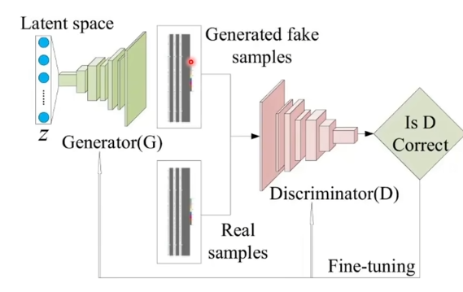

### FID

FID（Fréchet Inception Distance）是一种用于评估[生成模型](https://so.csdn.net/so/search?q=生成模型&spm=1001.2101.3001.7020)和真实数据分布之间差异的指标。从真实数据分布和生成模型中分别抽取一组样本，然后使用预训练的CNN网络从这些样本中提取特征向量。接下来，计算两个分布的均值和[协方差矩阵](https://so.csdn.net/so/search?q=协方差矩阵&spm=1001.2101.3001.7020)，并计算它们之间的Fréchet距离，得到FID值。FID值越小，表示生成模型生成的图像越接近于真实数据分布。

$FID^2 = ||\mu_1 - \mu_2||^2 + Tr(\sigma_1 + \sigma_2 - 2(\sigma_1\sigma_2)^{1/2})$

其中$\sigma$为协方差矩阵，协方差的定义为$Cov(X,Y)=E(XY)-EXEY$, 协方差可以反应两个变量的协同关系， 变化趋势是否一致。同向还是方向变化。

**优点：**

1. 生成模型的训练集可以和Inception Net-V3不同
2. 刷分不会导致生成图片质量变差

**缺点：**

1. FID是衡量多元正态分布直接按的距离，但提取的图片特征不一定是符合多元正态分布的
2. 无法解决过拟合问题，如果生成模型只能生成和训练集一模一样的数据无法检测

### CLIP Score 文生图的指标

**CLIP score**是一种用于评估 text2img 或者 img2img，模型生成的图像与原文本（prompt text）或者原图关联度大小的指标。对于文生图的任务，就是利用CLIP评估prompt与生成图像之间的特征相似度。

### IS

Inception Score使用图片类别**分类器**来评估生成图片的质量。其中使用的图片类别分类器为Inception Net-V3。这也是Inception Score名称的由来。

**清晰度：**如果图像很清晰，那么Inception网络输出的概率值熵应该很小；

**多样性：**如果生成的图片很多样，那么$p(y)=\sum p(y|x^{(i)})$的熵很大，总体接近均匀分布。

**缺点：**

1. **不能使用在一个数据集上训练分类模型，评估在另一个数据集上训练的生成模型**
2. **神经网络中权值的细节改变可能很大的影响IS分数**
3. **Inception Score高的图片不一定真实**
4. **Inception Score低的图片不一定差**
5. mode collapse时Inception Score是无法检测的
6. **Inception Score不能反映过拟合**

### PSNR指标

PSNR（Peak Signal-to-Noise Ratio，峰值信噪比）是一种用于评估图像质量的指标。它通常用于比较原始图像与压缩或者经过处理后的图像之间的相似度，或者用于评估去噪、超分辨率等任务的性能。
$$
PSNR=10*log_{10}(\frac{MAX^2}{MSE})
$$

### SSIM 指标

SSIM（Structural Similarity Index，结构相似性指标）是一种用于评估图像质量的指标，它不同于PSNR，更加符合人眼对图像的感知。SSIM考虑了**图像的亮度、对比度和结构**三个方面的相似性，其计算公式如下：
$$
SSIM(x,y)=\frac{(2\mu_x\mu_y+c_1)(2\sigma_{xy}+c_2)}{(\mu_x^2+\mu_y^2+c_1)(\sigma_x^2+\sigma_y^2+c_2)}
$$
SSIM的取值范围在[-1, 1]之间，当两幅图像完全相同时，SSIM取值为1，表示完全相似；当两幅图像完全不同时，SSIM取值为-1，表示完全不相似。

### 格拉姆矩阵

n维欧式空间中任意**k个向量之间两两的内积所组成的矩阵**，称为这k个向量的格拉姆矩阵(Gram matrix)，这是一个**对称矩阵**。

元素提供了不同特征图之间的相关信息。既能体现出有哪些特征，又能体现出不同特征间的紧密程度。图像风格迁移领域将其定义为**风格特征**。

**风格迁移的pipeline：** 准备基准图像和风格图像-->使用特征提取器提取两个图像的feature map-->计算两个feature map的格拉姆矩阵，以两个图像的格拉姆矩阵的差异最小化为优化目标。

### 感知损失

感知损失在图像生成领域中比较常用。其核心是将gt图片卷积得到的高层feature与生成图片卷积得到的高层feature进行回归，从而约束生成图像的高层特征（内容和全局结构）。

# GAN

### GAN 是用来干什么的，怎么用的，介绍一下它的数学原理？

用于生成以假乱真的数据，如图像、音频或文本。它由两个神经网络组成：生成器和判别器。生成器试图生成与真实数据相似的样本，而判别器则试图区分生成的样本和真实的样本。

GAN 的数学原理基于博弈论和梯度下降优化。生成器和判别器通过最小化损失函数进行训练。生成器的损失函数包括两部分：一部分是生成的样本被判别为真实样本的概率的负对数似然，另一部分是生成的样本与真实样本之间的相似性度量（如欧氏距离或交叉熵）。判别器的损失函数包括两部分：一部分是将生成的样本误判为真实样本的概率的负对数似然，另一部分是将真实样本误判为生成的样本的概率的负对数似然。

### JS散度

JS（Jensen-Shannon）散度是一种用于度量两个概率分布之间的相似性的方法。是KL（Kullback-Leibler）散度的对称形式。
$$
JSD(P||D)=\frac{1}{2}KL(P||M)+\frac{1}{2}KL(Q||M),M是P和Q的平均分布
$$
KL散度用于度量一个概率分布相对于另一个概率分布的不确定性。它的计算公式如下：
$$
KL(P||Q)=\sum_xP(x)log\frac{P(x)}{Q(x)}
$$
**JS散度的缺点：**如果两个分布 P,Q 离得很远，完全没有重叠的时候，那么KL散度值是没有意义的，此时JS散度值是一个常数，梯度为0。

### GAN 为什么不好收敛？

1. GAN 的训练过程涉及到两个网络（生成器和判别器）之间的对抗，这种对抗性可以导致训练过程的不稳定。
2. 生成器和判别器之间的博弈过程相当复杂，因为两者的目标是互相优化，但是没有一个明确的最优解。
3. 模式崩溃： 当生成器找到了一个成功愚弄判别器的策略时，它可能会生成少数几种高度相似的样本，而忽视其他潜在的数据分布。这导致生成的样本缺乏多样性，而且可能无法涵盖真实数据分布的所有模式。
4. 梯度消失和梯度爆炸： 在训练过程中，生成器和判别器的梯度计算可能会出现梯度消失或梯度爆炸问题，这可能导致参数更新不稳定，进而影响收敛性。
5. 超参数选择： GAN 的训练涉及许多超参数，如学习率、网络结构、损失函数权重等。不当的超参数选择可能导致训练过程难以收敛。

### 为什么 GAN 中的优化器不常用 SGD？

1. SGD 在 GAN 中可能导致训练过程不稳定
2. SGD 在深度神经网络中可能会引起梯度消失或梯度爆炸问题
3. GAN 的损失函数是一个非常复杂的非凸函数，存在许多局部最小值和鞍点。SGD 在寻找全局最小值时可能会受到困扰。

### GAN的损失函数是什么？

$$
loss_D=-log(D(x))-log(1-D(G(z)))
$$

$$
loss_G=-log(D(G(z)))
$$

### 训练GAN的技巧

1. 选择合适的损失函数可以影响训练的结果。传统的 GAN 使用最小最大博弈的损失函数，但更稳定的变体如 WGAN，在某些情况下可以更好地处理模式崩溃和梯度消失等问题。
2. 使用正则化技术如权重剪枝、批量归一化等，可以帮助稳定训练过程。
3. 确保生成器和判别器的能力相当。过强的生成器可能会导致模式崩溃，而过强的判别器可能会阻碍生成器的学习。
4. 确保生成器和判别器的能力相当。过强的生成器可能会导致模式崩溃，而过强的判别器可能会阻碍生成器的学习。
5. 在每个训练迭代中，可以选择更新判别器的次数超过生成器，以确保判别器能够跟上生成器的更新速度。

### WGAN为什么能处理梯度消失和梯度爆炸

在标准的GAN中，由于使用了生成器和判别器之间的交叉熵损失函数，**当生成器的输出与真实数据的分布差异较大时，梯度可能会消失或爆炸，导致训练不稳定**。

Wasserstein距离在数学上对几乎所有概率分布都是有意义的，并且**具有更好的连续性和凸性质**，因此更容易优化。
$$
Loss_G=-E(D(G(z)))
$$

$$
Loss_D=E(D(x))-E(D(G(z)))
$$

此外，WGAN还引入了一些其他技术，如**权重剪裁（weight clipping）或梯度惩罚（gradient penalty）**，进一步提高了稳定性和收敛速度。

### Pix2pix 和 cycleGan 的区别？

Pix2Pix旨在学习图像之间的一对一映射，即给定输入图像，生成对应的输出图像。

CycleGAN旨在学习两个域之间的映射，而不需要成对的训练数据。CycleGAN采用了循环一致性损失，允许模型在没有成对训练数据的情况下学习域之间的映射。

### LSGANs

LSGANs（Least Squares Generative Adversarial Networks）是一种生成对抗网络（GAN）的变种，旨在改善原始GAN中的训练稳定性和生成图像的质量。LSGANs的主要特点是**使用最小二乘损失函数**来代替原始GAN中的二元交叉熵损失函数。

二元交叉熵损失函数在训练过程中可能会导致**模式崩溃（mode collapse）或梯度消失**的问题，尤其是在训练初期。
$$
L_G=\frac{1}{2}\mathbb{E}_{x~p_{data}(x)}[(D(G(z))-1)^2]
$$

$$
L_D=\frac{1}{2}\mathbb{E}_{x~p_{data}(x)}[(D(x)-1)^2]+\frac{1}{2}\mathbb{E}_{z~p_z(z)}[D(G(z))^2]
$$

LSGANs使用了最小二乘损失函数，这使得生成器和判别器在训练过程中对真实和生成数据的处理**更加平滑**。通过使用最小二乘损失函数，LSGANs可以提高训练的稳定性，减少模式崩溃和梯度消失的问题，同时生成更加逼真的图像。

### 模式崩溃问题

指的是生成器倾向于生成相似或重复的样本，而忽略了数据分布中的多样性。

1. **判别器过于强大**：如果判别器能够准确地区分生成的样本和真实的样本，那么生成器可能会找到一种简单的生成方式，以欺骗判别器，而忽略了数据分布中的其他模式。
2. **训练不稳定**：GAN的训练过程本身就很不稳定，当生成器和判别器的更新速度不平衡或损失函数设计不合理时，容易导致模式崩溃。
3. **数据分布不均匀**：如果数据集中某些模式的出现频率比其他模式高得多，生成器可能会倾向于生成这些常见的模式，而忽略了其他模式。

避免方法：

1. **增加数据多样性**：确保训练数据集包含各种不同的模式和样本，以便生成器能够学习到整个数据分布的多样性。
2. **使用正则化技术**：通过添加正则化项或限制生成器的容量，可以防止生成器学习到过度简化的模型。
3. **改进损失函数**：设计更合适的损失函数，例如使用Wasserstein距离或Least Squares损失，可以改善训练的稳定性，减少模式崩溃的发生。
4. **监督训练**：在训练过程中监督生成器的学习过程，确保生成器生成的样本涵盖了整个数据分布的多样性，而不仅仅是局部的模式。

### DCGAN

DCGAN（Deep Convolutional Generative Adversarial Networks）是生成对抗网络（GAN）的一个改进版本，旨在通过引入深度卷积神经网络来提高生成器和判别器的性能和稳定性。

### 生成对抗网络能否用于其他任务

1. **语音合成和转换**：GAN可以用于生成逼真的语音样本，或者用于语音转换任务，例如从一种语音风格转换为另一种语音风格，或者实现说话人转换。
2. **文本生成**：GAN可以用于生成逼真的文本数据，例如生成自然语言描述的图像、生成对话或故事等。
3. **数据增强**：GAN可以用于生成合成数据，以增加训练数据的多样性和丰富性，从而提高深度学习模型的性能。

### 什么是生成对抗网络的生成器的输入噪声（Latent Noise）？为什么要引入噪声？

生成对抗网络（GAN）的生成器的输入噪声（Latent Noise）是一个随机向量或随机张量，通常从某种潜在空间中随机采样而得。生成器将这个噪声作为输入，并试图将其转换为逼真的数据样本，例如图像、音频或文本。

1. **增加数据多样性**：通过在生成器的输入中引入随机噪声，可以促使生成器生成**多样化**的数据样本。这样可以**防止生成器过度拟合**训练数据，并使其生成更加多样化和逼真的样本。

2. **提高模型的鲁棒性**：噪声可以增加模型的鲁棒性，使其更能够处理来自不同分布或具有不同特征的数据。这有助于生成器更好地泛化到新的、未见过的数据样本。
3. **控制生成样本的多样性**：通过调整输入噪声的分布或参数，可以控制生成器生成样本的多样性程度。这可以用于生成样本的插值、插图、样式变换等应用。

### GAN如何处理多模态数据，例如文本到图像的生成

将文本描述转换为文本嵌入（text embedding）或语义向量（semantic vector），然后将这些向量作为生成器的输入之一。在训练过程中，同时使用文本描述和对应的图像作为输入数据。生成器的输入可以是随机噪声和文本描述的组合，而判别器则同时判断生成的图像和真实图像的逼真程度。

cGAN是一种生成对抗网络的变种，它在生成器和判别器中都引入了条件信息，通常是将文本描述作为生成器和判别器的条件输入。这样生成器可以根据给定的文本描述生成相应的图像，而判别器可以根据文本描述来判断生成的图像的逼真程度。

### 有哪些提高GAN训练稳定性的Tricks？

1. 使用Earth Mover distance作为损失函数
2. 标签反转，用生成的图像当作real，真实的图像当作fake
3. 使用高斯分布进行采样
4. 使用BN
5. 避免使用ReLU，MaxPool等操作引入稀疏梯度
6. 使用Soft Label和Noisy的标签
7. 使用Adam作为生成器的优化器，SGD为判别器的优化器
8. 在输入端适当添加噪声
9. 多训练判别器
10. 梯度惩罚，可以减少模式崩溃的问题

# VAE

# Diffusion

**Motivation: **

1. 由于GAN对抗训练的本质，可能导致训练过程不稳定，发生模式崩溃，梯度消失/爆炸，收敛困难等问题；
2. GAN虽然能生成高保真都的样本，但是在某些复杂分布或特定数据集上可能会出现伪影，模糊边界，多样性不足等问题；
3. 对于条件生成任务，GAN和VAE可能存在条件信息融入不充分或不均匀的问题
4. VAE通常生成的样本质量不如GAN

**优点：**

1. 扩散模型通常采用更稳定的最大似然估计框架进行训练，提供了更平滑的训练过程；
2. 扩散模型通过逐步噪声注入和去除的扩散过程，能够生成细节丰富，清晰且多样化的样本，尤其是在高分辨率图像生成方面
3. 通过扩散和逆扩散的过程中有效地引导噪声的添加和去除，能够更好地控制生成过程，使得生成样本更精确地符合给定条件
4. 扩散步骤和进展都可追踪和干预，有更好的可控性和可解释性；

**Method：**

**扩散过程：**

1. 重参数：通过重参数的方法使得加入的噪声可微；
2. 任意时刻的$x_t$可以又$x_0$和$\beta_0$表示：

$$
x_t=\sqrt{\hat \sigma_t}x_0+\sqrt{1-\hat \sigma_t}\epsilon
$$

**逆扩散过程：**

