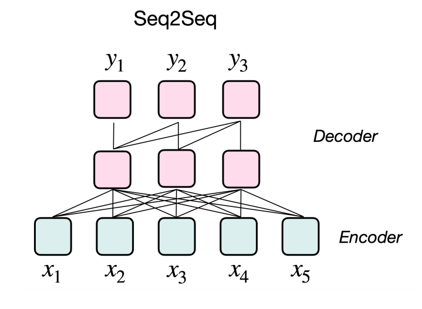
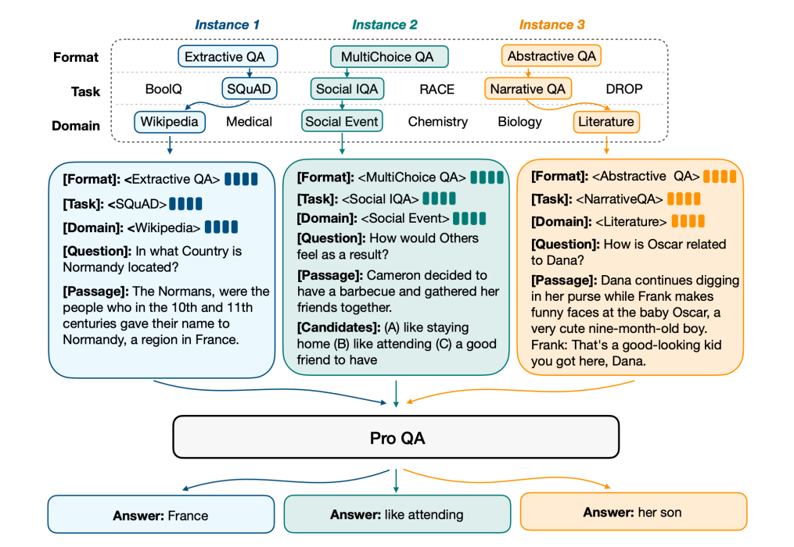

# 词表示与语言模型

将词转换成机器能够理解的形式， **word similarity**， **word relation**

one-hot编码（词与词正交），字典（同义词，上位词，但是会存在一词多义的情况），使用context words表达这个词（词表大的时候需要很多存储），word embedding(Word2Vec)

### N-gram Model

collect statistics about how frequent different n-grams are,and use these to predict next word.

考虑前几个词的，预测下一个词。

Markov assumption
$$
P(w_1,w_2,...,w_n)=\prod_{i}P(w_i|w_{i-k},...,w_{i-1})
$$
问题：N-gram考虑的上下文较少，如果N越大统计结果越稀疏，没有办法捕获词之间的相似度


### Word2Vec

Using shallow neural networks that associate words to distributed representations.It can capture many linguistic regularities.

**Continuous bag-of-words(CBOW)**

对于句子，Never too late to learn, 假定窗口大小是5， $$P(late|never,too,to,learn)$$.

**Continuous skip-gram**


**when the vocabulary size is very large**: Negative sampling，采样一小部分的词表进行采样，按照词频的概率进行采样

**Other Tips for Word Enbeddings**

1. sub-sampleing: Rare words can be more likely to carry distinct information, according to which, sub-sampling discards words 𝑤 with probability:  $$1-\sqrt{t/f(w)}$$
2. Soft sliding window: Sliding window should assign less weight to more distant words


### RNNs

**Key concept for RNNs:** Sequential memory  during processing sequence data


RNN Cell


当前的状态是由过去的状态获得到的

**优点:**Can process any length input, Model size does not increase for longer inpu, Weights are shared across timesteps, Computation for step 𝑖 can (in theory) use information from many steps back

**缺点：**Recurrent computation is slow , it’s difficult to access information from many steps back


### Gated Recurrent Unit(GRU)

update gate, reset gate 用于权衡过去的信息与当前信息的比重问题


### Long Short-Term Memory Network (LSTM)


**Fortget gate:** decide what information to throw away from the cell state


**input gate: **decide what information to store in the cell state


**update the old cell state $$C_{t-1}$$**


**output gate:** decide what information to output  


**优点：**

1. Powerful especially when stacked and made even deeper   

2. Very useful if you have plenty of data  


### Bidirectional RNNs

in many applications, we want to have an output $$y_t$$depending on the **whole input sequence**


### Attention

**Seq2seq: The bottleneck problem**


1. The single vector of source sentence encoding needs to capture  all information about the source sentence.
2. The single vector limits the representation capacity of the encoder: the information bottleneck

**eos 最后一个向量的容量限制了Encoder的表达**

解决方法--> Attention

1. Attention provides a solution to the bottleneck problem  
2. Core idea: at each step of the decoder, focus on a particular part of the source sequence


### Seq2Seq with Attention


#### Attention Mechanism

1. Encoder hidden states: $$h_1, h_2, ...,h_N$$
2. Decoder hidden state at time step t: $$s_t$$
3. attention score $$e^t=[s_1^Th_1, ..., h_t^Th_N]$$
4. Use softmax to get the attention distrubution $$\alpha^t=softmax(e^t)$$
5. attetion output $$o_t=\sum_{i=1}^N \alpha_i^th_i$$
6. Concatenate the attention ouput and the decoder hidden state to predict the word $$[o_t; s_t]$$


#### definition of attention:  

Given a query vector and a set of value  vectors, the attention technique computes a **weighted sum of the  values  according to the query**.

The weighted sum is  a selective summary of the values.

We can obtain a fixed-size representation of **an arbitrary set of representations** via the attention mechanism.


### Insights of Attention

1. 解决信息瓶颈， The decoder could directly look at source  
2. 防止梯度消失， By providing shortcuts to long-distance states  
3. 提供可解释性


### Transformer

**Motivations:**

1. Sequential computation in RNNs prevents parallelization  
2. Despite using GRU or LSTM, RNNs still need attention mechanism which provides access to any state
3. Maybe we do not need RNNs?  


#### Byte Pair Encoding (BPE)

使用空格进行词语的切分有时候并不好

计算语料库中每一个byte gram 出现的数量，将频度最高的Btye gram抽象成一个词加入到词表中。

1. Start with a vocabulary of characters
2. Turn the most frequent n-gram to a new n-gram  

**Motivation:**

1. Solve the OOV  **(out of vocabulary) problem** by encoding rare and unknown words as sequences of subword units
2. In the example above, the OOV word "lowest" would be segmented into **"low est”**


### Positional Encoding (PE)

**Motivation:**

1. The Transformer block is not sensitive to **the same words  with different positions**
2. The positional encoding is added so that the same words at different locations have different representations.


### Transformer Encoder Block


**Two sublayers**: Multi-Head Attention, Feed-Forward Network(2-layer MLP)

**Two tricks**: Residual connection, Lyaer normalization(changes input to have mean 0 and variance 1)


**Scaled Dot-Product Attention:** As $$d_k$$ get large, the variance of $$q^Tk$$​ increase, the softmax gets very peaked, gradient gets smaller, 一个位置的数值为1，其他位置的为0，导致梯度越来越小，scaled的目的是使得输出的向量方差接近1


### Transformer Decoder Block

1. Masked self-attention: The word can only look at **previous** words


2. Encoder-decoder attention: Quries come from the decoder while keys and values come from the encoder


**优点：**

1. 具有很强的表示能力
2. attention， FFN适合并行计算
3. 可解释性

**缺点：**

1. 难以优化，对超参数以及优化器等选择敏感
2. `O(n^2)`的时间复杂度，文本长度有限制 


### Pretrain Language Model (PLM)

word2vec, GPT, BERT, …  

PLMs: language models having powerful  transferability for other NLP tasks

**Feature-based methods:** word2vec. Use the outputs of PLMs as the inputs of our downstream models.

**Fine-tuning methods:** BERT,GPT. The language models will also be the downstream models and their parameters will be updated.


### 语言模型评价指标Perplexity

PPL是用在自然语言处理领域（NLP）中，衡量语言模型好坏的指标。它主要是根据每个词来估计一句话出现的概率，并用句子长度作normalize，公式为：
$$
PP(S)=^N\sqrt{\prod_{i-1}^N\frac{1}{P(w_i|w_1,w2,...,w_{i-1})}}
$$
S代表sentence，N是句子长度，$$P(w_i)$$是第i个词的概率。第一个词就是 $p(w_1|w_0)$，而$w_0$是START，表示句子的起始，是个占位符。

PPL越小，$p(w_i)$则越大，一句我们期望的sentence出现的概率就越高,模型越好。


### GPT


GPT表现出了强大的zero-shot能力，通过我们提问的方式，GPT可以通过自回归的方式来生成对话结果。


### BERT

Change the paradigm of NLP significantly

**Problem:** 

Language models only use left context or right context, but language understanding is  **bidirectional**.

**Why are LMs unidirectional?  **

1. Directionality is needed to generate a wellformed probability distribution ， 自然地把长文本拆解成小部分
2. Words can “see themselves” in a bidirectional encoder 信息泄露


#### **Solution：**Mask  out k% of the input words, and then predict the masked words.

**15%是一个综合的考量**

1. Too little masking: too expensive to train  
2. Too much masking: not enough context  


**Problem：[mask] token never seen at fine-tune, [mask] token在微调的时候是不可见的，所以会导致微调的性能下降**

**Solution：**

1. 80%的可能保留[mask] token
2. 10%的可能替换成一个随机的词，然后希望将该词进行一个纠错，让模型关注不是[mask]的词，但是这样可能导致模型认为所有的词都是错的
3. 10%的可能保持原本的词


### BERT：Next Sentence Prediction

**To learn relationships  between sentences, predict whether Sentence B is the actual sentence that proceeds Sentence A, or just a random sentence**


### BERT: Input Repressentation

1. **token embedding:** Use 30,000 WordPiece vocabulary on input , token embedding 层是要将各个词转换成固定维度的向量。在BERT中，每个词会被转换成768维的向量表示
2. **Segment Embeddings:** Segement Embeddings 层有两种向量表示，前一个向量是把 0 赋值给第一个句子的各个 Token，后一个向量是把1赋值给各个 Token，问答系统等任务要预测下一句，因此输入是有关联的句子。而文本分类只有一个句子，那么 Segement embeddings 就全部是 0。
3. **Position Embeddings:** BERT能够处理最长512个token的输入序列。通过让BERT在各个位置上学习一个向量表示来讲序列顺序的信息编码进来。
4. **[CLS]的作用：** BERT在第一句前会加一个[CLS]标志，最后一层该位对应向量可以作为整句话的语义表示，从而用于下游的分类任务等。


### Summary

1. Feature-based 的方法给下游任务提供一个有上下文的word embedding，固定了输入的feature，效果比较有限
2. Fine-tuning的方法的参数在整个下游任务中得到调整，性能更高
3. BERT的预训练和下游任务存在较大的gap，训练的效率比较低，因为只有15%的单词被预测，训练的窗口较小，只有512


### GPT-3

**Excellent few-shot/in-context learning ability  **


### T5 (Encoder-Decoder)

Reframe all NLP tasks into a unified text-to-text-format where the input and output are always text strings .

采用Seq2Seq的方式去生成一个句子的答案。


### Large Model with MoE （Miture of Experts）

采用MoE的方式去增大模型的参数，训练更大规模的预训练语言模型。

**Key idea：** 把模型的参数分成一块一块的模块，每次的模型输入只调用其中部分子模块来参与计算


# Prompt

### T5

采用Seq2Seq的方式去训练模型，给模型一个句子让他输出我们希望的结果

1. Encoder-decoder with 11 billion parameters  
2. Cast tasks to seq2seq manner with simple demonstrations  
3. A decoder is trained to output the desired tokens  

### GPT3

1. Huge model with 175 billion parameters  
2. No parameters are updated at all  
3. Descriptions (Prompts) + Few-shot examples to generate tokens  


### How to Adapt Large-scale PLMs

1. 全参数微调大模型是不现实的；
2. 对每一个任务都微调一个模型，那么如果下游任务很多的话就需要存储n个模型实例；

因此我们要高效的微调模型，例如**prompt learning**， **delta tuning**(只微调部分参数)


### Prompt Learning

pretrain 和 fine-tuning之间存在很多的GAP


**Add additional context(template) with a [MASK] position**

即使任务不同，但是我们可以利用这种范式去统一微调的过程。


**Example:**

情感分类


### 如何选择预训练的模型

1. Auto-regressive (GPT, OPT)， 单向attention，所以有更好的生成能力，适合超大规模的预训练模型，采用如下的[MASK]在最后的prompt


2. Maked Language Modeling (BERT), 双向attension，所以有更好的理解能力，模板的[MASK]不用考虑位置


3. Encoder-Decoder(T5, BART), Encoder阶段是双向的attention，Decoder是单向的attetion




### 如何选择Template

1. 人工的构造，效果一般都不错，但是要考虑任务的特性来构造不同的template，需要人的先验知识
2. 自动的生成，采用搜索的方式去生成Template，或者可以不一定是文本，通过训练的方式

**Example1**


**Example2: Extract World Knowledge**

1. Copy the entity in the Template
2. Predict fine-grained entity types
3. Extract world knowledge


**Example3: Structured Template**

采用同一种Template，训练不同的任务。

1. Key-value Pairs for all the prompts
2. Organize different tasks to a structured format




**Example4： Automatic Search**

Gradient-based search of prompts based on existing words

我们发现，训练得到的template可能语法不同。

启示：Prompt的目的是要去触发我们想要的token，实际上对于机器来说可能不一定要使用和人一样的prompt


**Example5： Using a encoder-decoder model to generate prompts**


**Example6: Promptint with Continuous Templates P-tuning**

将模型冻结住，只去训练那些prompt embedding

1. Genetative models for NLU by optimizing continuous prompts
2. P-tuning v1: prompts to the input label (with Reparameterization)
3. P-tuning v2: prompts to ever layer (like prefix-tuning)


**结论：**

1. 在Few-shot时候性能特别好
2. 不同的模板对结果有很大的影响


### 如何Verbalizer

1. 人工设计
2. 利用额外的知识扩充

Verbalizer其实就是将标签映射成标签词的过程， Mapping: Answer->Unfixed Labels，例如：


上图中，positive可以对应很多词，可以对这些词的概率做平均或者加权平均，得到Positive这个类的概率。

**Verbalizer的形式：**

1. Tokens: 可以是一个词或者多个词
2. Chunks： 可以是一个字符串
3. Sentence

### **Verbalizer的构造：**

1. 手工设计：Manually design with human prior knowledge  
2. 从一个label word开始去寻找同义词：Start with an initial label word, paraphrase & expand . 当这个词表越来越大时会为模型提高容错率，但是也会带来更多的噪音
3. Start with an initial label word, use external knowledge & expand.
4. Decompose the label with multiple tokens.
5. Virtual token and optimize the label embedding  

Verbalizer的目的怎么利用模型预测的分布

**Example1: Knowledgeable Prompting**


**Example2: Virtual Tokens as Label Words**

Project the hidden states of [MASK] tokens to the embedding space and learn **prototypes**

The learned prototypes constitute the verbalizer and map the PLM outputs to corresponding labels  


### Prompt Tuning

**Example1： soft prompts**

给模型加一些soft prompts，只训练soft embedding，模型的结果在大参数上获得的效果与全参数微调类似。

实际上，Prompt tuning与prompt learning的思路大相径庭，**prompt tuning 是希望通过模型强大的拟合能力来适应下游的数据，而prompt learning希望把预训练和下游任务之间的gap弥补起来。**


**Example2： Multi-task pre-training with hand-crafted prompts (instruction-tuning)**


### Summary Prompt-Learning

1. **A comprehensive framework** that considers PLMs, downstream tasks, and human prior knowledge
2. The design of **Template & Verbalizer** is crucial  
3. Prompt-learning has promising performance in low-data regime, and high variance with the select of templates
4. Prompt-learning has broad applications  


### Delta Tuning

Only updating **a small amount of parameters** of PLMs , Keeping the parameters of the PLM **fixed **


**Why Parameter Efficient Work**

Pre-training can learn **Universal Knowledge **


**Delta Tuning的范式：**

1. **Addition-based  methods** introduce extra trainable neural modules or parameters that do not exist in the original model; 增加一些额外的可学习参数
2. **Specification-based  methods** specify certain parameters in the original model or process become trainable, while others frozen; 部分参数可学习
3. Reparameterization-based methods reparameterize existing parameters to a parameter-efficient form by transformation.


### Addition-based：Adapters

1. Injecting small neural modules (adapters) into Transformer Layer  
2. **Only fine-tuning adapters** and keeping other parameters frozen  
3. Adapters are **down-projection and up-projection **


**Example1: Move the Adapter Out of the Backbone**

Ladder Side Network，使得梯度反向传播的时候不需要传递到backbone中，节省了很多计算和显存


**Example2：Prefix-Tuning**

**Inject prefixes (soft prompts) to each layer of the Transformer** ，Only optimizing the prefixes of the model 。在每一层的Transformer前面加入soft token，这个方法和Prompt-Tuning比较相似。


### Specification-based

**Example1： BitFit**

A simple strategy: only updating the bias terms ， 只去微调模型的bias参数


### Reparameterization-based   重参数化方法

**预训练模型拥有极小的内在维度(instrisic dimension)，即存在一个极低维度的参数，微调它和在全参数空间中微调能起到相同的效果**。

**Example1： Low-dimension space**

假设：PLM优化的过程可以在一个低维空间内完成，将n个任务的优化压缩到一个低维的子空间里，在低维的空间里面去训练参数，再将它放缩到原来的维度里


**Example2: LoRA Low-Rank Adaptation**

Key idea: 要优化的矩阵虽然不是一个低秩的，但是我们可以对它做一个低秩分解，例如，对一个1000×1000的矩阵可以分解成一个1000×2 和 2×1000，从而减少计算量。

对于预训练的权重矩阵$W_0 \in \mathbb{R}^{d \times k}$, 我们可以用一个低秩分解来表示参数更新$\Delta W$， 即：
$$
W_0=\Delta W = W_0 + BA,B \in \mathbb{R}^{d\times k} and A\in \mathbb{R}^{r\times k}
$$


Freeze the model weights , **Injects trainable rank-decomposition**  matrices to each Transformer layer


**Example3: Connections**

存在一个低维空间可以表示微调大量的下游任务，因此可以组合各种Delta-tuning


1. **Left:** there exist a low-dimensional intrinsic subspace that could reparameterize one specific fine-tuning process (the left part).   
2. **Middle:**the change of weights during adaptation has a low intrinsic rank (the middle part)  
3. **Right: **there may exist **a common intrinsic space** that could handle the **fine-tuning for various NLP tasks** (the right part).  


**Theoretical Analysis：**

Low-dimensional representation in solution space  

Low dimensional representation in functional space  


**Automatically search the structure**

自动地组合各种Delta-Tuning， 从而得到一个比较稀疏的解，使得即使参数量更少的时候也能够work


### Summary： Delta Tuning

1. 高效的
2. 当模型的参数很大的时候可以不需要太过考虑Adapter的结构。


# 大模型的训练和推理

### CPU vs. GPU

CPU: small number of large cores.

GPU: large number of small cores.  


**CPU controls GPU**


****


**Memory Components**

1. 模型的参数
2. 反传的梯度
3. 模型的中间结果
4. 优化器


Adam优化器的参数：


#### **Collective Communication**

**Broadcast：**Send data from one GPU to other GPUs.  


**Reduce：** Reduce (Sum/Average) data of all GPUs, send to one GPU.  


**All reduce:** Reduce (Sum/Average) data of all GPUs, send to all GPUs.  


**Reduce Scatter:** Reduce (Sum/Average) data of all GPUs, send portions to all GPUs.  


**All Gather:** Gather data of all GPUs, send all GPUs.  


****


#### Data Parallel

1. 需要一个参数服务器（实际上这个参数服务器就是0号显卡），用来保存模型的参数以及完整的一批数据
2. Forward：

​	参数服务器中的模型参数会被复制到所有的显卡中，把数据切分成三份，进行前向传播

3. Backward：

​	每个显卡中的计算梯度，后进行聚合，传递到参数服务器中。利用优化器对参数服务器中的模型进行参数更新，再重新分发参数给显卡


#### Distributed Data Parallel

不需要参数服务器，每张显卡各自的保证自己的参数更新

1. Forward:

​	每个显卡得到一部分的输入

2. Backward：

​	每个显卡各自更新参数，为了让每张显卡得到同样的梯度，采用All Reduce算子


#### Model Parallel

原理： 可以将以下的矩阵乘法分很多个部分，再进行结果的拼接，这样就可以把模型的参数分发到不同的显卡中


每个GPU的输入数据是相同的，将模型切分很多个小份，将输出结果进行拼接得到最终的结果，最后采用All Gather


#### ZERO，Zero Redundancy Optimizer

对于模型并行来说，每个GPU上的参数更新都是使用的同样一批的梯度，他们各自去进行模型的优化带来了计算上的重复和冗余，为了消除冗余，每张显卡只计算部分的梯度更新部分的参数。

每张GPU上保存了完整的模型参数和一部分的数据，每张GPU会得到不同的梯度，通过Reduce Scatter使得每个GPU上模型只更新部分的参数，最后采用All Gather将模型的参数进行拼接。

Zero2：在梯度反向传播的过程中计算Gradient*同时不断地释放Gradient的参数

Zero3： 每张显卡上可以只保存它所负责的参数更新的那部分参数，因此在前向传播的过程中通过All Gather的方式来获得模型的完整参数，使用完后即可删除


#### Pipeline Parallel

将模型的不同层发放给不同的GPU，因此每张显卡中只需要保留部分的参数，部分的梯度，部分的优化器，部分的中间结果。

弊端： 在一个显卡计算的时候其他的显卡处于空闲状态


#### 混合精度训练

采用FP16参数和梯度进行前向传播和反向传播，利用FP32的参数用于更新优化器

FP16的优点：

1. 计算速度更快
2. 需要更小的空间
3. 同时参数的空间范围足够大了

FP16的缺点：

1. 参数的更新$Weight update = gradient*lr$， FP16的最小的范围在$6.1e-5$，那么在参数更新的过程中可能会出现下溢的问题，使得参数的更新为0


#### Offloading

对于Adam来说，优化器的参数会是模型参数的两倍以上，因此如果把优化器放在显卡上会占据大量的显存。

因此把优化器的参数放到CPU中，参数更新时需要把模型的参数从GPU传递到CPU，在CPU上进行优化，再将优化的结果重新传会GPU


#### Overlapping

在GPU中memory的操作一般是异步的，我们可以先给memory发送一个请求，然后去进行其他的计算，计算完成之后对memory的请求进行接收

例如下面的操作，我们在执行layer1的计算之前先gather layer2的参数，在执行layer2的计算之前gather layer3的参数


#### checkpoint

用于减少中间结果的保存，例如只保存每个block的输入和输出，这样在反向传播的时候对输入进行一个重计算就可以得到梯度信息。


#### 知识蒸馏

**what is knowledge:** 模型的参数的连接和组合，更抽象来说就是输出和输出的函数的映射关系。

因此学生模型的目标是学习教师模型的一个子空间的映射，因为小的模型的表示能力小于教师模型。

对于监督信号来说是一个值，而对于教师模型的输出来说是一个概率分布，这个概率分布有时候能够提供更多的监督信息。

**PKD：**Learn from multiple intermediate layers of the teacher model  


**TinyBERT**

不仅对输入输出的特征进行约束，还对attention matrix相似度进行刻画。


#### Model Pruning

在卷积神经网络中，卷积核是很稀疏的，所以能不能叫为0的参数给丢弃掉；或者通过梯度的大小来衡量参数的重要性。

结构化剪枝：一次性将矩阵中的一行或者一块删除，使得GPU更好地加速

**Example1：**  将Attention 的某个 head丢弃掉

**Example2：** 将模型的某几层给丢掉


#### Model Quantization

Reduce the number of bits used to represent a value  

**Example1： BinaryBERT**

1. Initialize a binary model with the ternary model by weight splitting  
2. Fine-tune the binary model  


### Tokenizer

```python
from tokenizers import Tokenizer
from tokenizers.models import BPE
tokenizer = Tokenizer(BPE(unk_token="[UNK]")) # 定义未知的符号

# 训练自己的分词器，其中special_tokens会被映射到0,1,2,3...
from tokenizers.trainers import BpeTrainer
trainer = BpeTrainer(special_tokens=["[UNK]", "[CLS]", "[SEP]", "[PAD]", "[MASK]"])

# 使用预标记器将空格区分开来
from tokenizers.pre_tokenizers import Whitespace
tokenizer.pre_tokenizer = Whitespace()

# 训练自己的分词器
files = [f"data/wikitext-103-raw/wiki.{split}.raw" for split in ["test", "train", "valid"]]
tokenizer.train(files, trainer)

# 保存
tokenizer.save("data/tokenizer-wiki.json")

tokenizer = Tokenizer.from_file("data/tokenizer-wiki.json")

output = tokenizer.encode("Hello, y'all! How are you 😁 ?")
print(output.tokens)
# ["Hello", ",", "y", "'", "all", "!", "How", "are", "you", "[UNK]", "?"]
print(output.ids)
# [27253, 16, 93, 11, 5097, 5, 7961, 5112, 6218, 0, 35]

# post-process
from tokenizers.processors import TemplateProcessing
tokenizer.post_processor = TemplateProcessing(
    single="[CLS] $A [SEP]",   # 句子模板，其中A为句子
    pair="[CLS] $A [SEP] $B:1 [SEP]:1", # 句子对模板
    special_tokens=[
        ("[CLS]", tokenizer.token_to_id("[CLS]")), # 指定我们使用的特殊标记及其 ID
        ("[SEP]", tokenizer.token_to_id("[SEP]")), # 指定我们使用的特殊标记及其 ID
    ],
)

output = tokenizer.encode("Hello, y'all! How are you 😁 ?")
print(output.tokens)
# ["[CLS]", "Hello", ",", "y", "'", "all", "!", "How", "are", "you", "[UNK]", "?", "[SEP]"]
output = tokenizer.encode("Hello, y'all!", "How are you 😁 ?")
print(output.tokens)
# ["[CLS]", "Hello", ",", "y", "'", "all", "!", "[SEP]", "How", "are", "you", "[UNK]", "?", "[SEP]"]
print(output.type_ids)
# [0, 0, 0, 0, 0, 0, 0, 0, 1, 1, 1, 1, 1, 1]

# using pretained tokenizer
from tokenizers import Tokenizer
tokenizer = Tokenizer.from_pretrained("bert-base-uncased")
```


